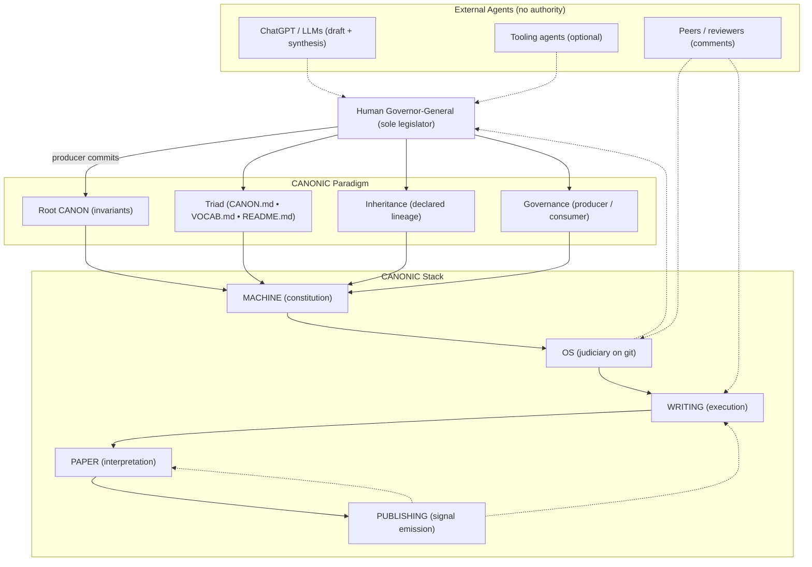

# PAPER

**The CANONIC paper specification.**

This document defines **what the paper is, how it is produced, and how it evolves** under CANONIC governance.  
It is a **constitutional specification**, not the manuscript itself.

`00-PAPER.md` is a **human legislative artifact**.  
The manuscript is generated under this constraint and validated externally.

---

## 1. Subject

This paper documents and analyzes the **CANONIC system** as an institutional, governed process.

It concerns the interaction of six strictly separated layers:

**CANONIC** — paradigm and law  
**MACHINE** — constitution enforcement  
**OS** — governance enforcement on git  
**WRITING** — execution under constraint  
**PAPER** — interpretation and science  
**PUBLISHING** — external signal emission  

The paper is **not** a tooling description, implementation guide, or optimization manual.

---

## 2. Purpose

The purpose of this paper is to:

> **Empirically evaluate whether constitutional governance, stabilized vocabulary, and explicit separation of authority reduce drift and improve clarity in human–LLM writing systems.**

The paper discovers **best practices** by analyzing **its own governed production**, using git execution traces as evidence.

**Hypothesis:** Standardized episode templates reduce episode drift. The test compares episodes before and after template canonification; episodes are the analysis record.

---

## 3. Canonical Roles (Dual Framing)

### 3.1 Engineering framing

| Role | Engineering term |
|---|---|
| Change definition | **Producer** |
| Change application | **Consumer** |
| Enforcement | **Validator** |
| Execution trace | **Ledger (git)** |

### 3.2 Canon law framing

| Role | Canon law term |
|---|---|
| Law creation | **Legislator** |
| Law application | **Executor** |
| Law enforcement | **Judiciary** |
| Dispute resolution | **Litigation / redo** |

These framings are equivalent and used interchangeably where clarity demands.

---

## 4. Minimal System Architecture

### 4.1 CANONIC paradigm and machine stack

---

## 5. Definition of Each Layer

### 5.1 CANONIC (law)

- Declares invariants, vocabulary, and inheritance
- Defines what is valid and invalid
- Changes only through **human producer commits**
- Does not execute or interpret

### 5.2 MACHINE (constitution)

- Enforces CANONIC constitution only
- Defines evaluation, decision, and signal behavior
- Produces no prose and asserts no meaning

### 5.3 OS (judiciary on git)

- Enforces CANONIC constraints on git state
- Accepts or rejects commits
- Emits redo signals

### 5.4 WRITING (execution)

- Produces prose under constraint
- Operates in real time
- Has no authority
- Generates candidate artifacts only

### 5.5 PAPER (interpretation)

- Reconstructs what happened
- Treats git history and episodes as data
- Tests institutional hypotheses
- Never enforces or legislates

### 5.6 PUBLISHING (signals)

- Emits snapshots to external institutions
- Generates commentary, critique, and legitimacy signals
- Has zero governance authority

---

## 6. Episodes (Temporal Governance Units)

**Episodes are real-time, human-declared boundaries** capturing live execution.

Episodes:
- Span multiple commits
- May cross repositories
- Preserve drift, confusion, correction, and fixation
- Are immutable once closed

Episodes do **not** change canon by themselves.

Episodes live in `/canonic/machine/os/writing/paper/episodes/` and the paper evolves from this record.

They are the **primary empirical units** of this paper.

---

## 7. Method (Observational)

The paper uses **retrospective reconstruction** based on:

- Git commit history (authoritative ledger)
- Producer vs consumer commit sequences
- Episode boundaries
- Reverts and redo events
- Cross-repo synchronization
- SWAT analysis after any violation (prose layer)

No mechanisms are assumed.  
Only observable outcomes are reported.

---

## 8. Structure of the Manuscript

1. **Abstract** — Scope, method, summary findings  
2. **Introduction** — Problem of drift, institutional approach  
3. **System** — CANONIC architecture and separation of authority  
4. **Methodology** — Episodes and git-based reconstruction  
5. **Results** — Chronological episode analysis and patterns  
6. **Best Practices (Derived)** — Only when traceable to evidence  
7. **Discussion** — Interpretation and theory mapping (optional v0)  
8. **Limitations** — Scope, time horizon, non-claims  
9. **Conclusion** — What was shown, what remains untested  
10. **References**

---

## 9. Best Practice Constraint

A practice may be reported **only if**:

- It appears across multiple episodes
- It is traceable to git evidence
- It is phrased as an observation, not a rule

If it sounds like law, it belongs in CANONIC, not PAPER.

---

## 10. Publishing and Peer Review Plan

- **v0**: arXiv release (observational, minimal interpretation)
- **v1+**: incorporate external signals as new episodes
- Peer review is treated as **signal ingestion**, not authority
- No retroactive rewriting of history

---

## 11. Canonical Statement

> This paper empirically studies CANONIC writing as a governed institutional process, using git execution traces and real-time episodes to discover best practices for reducing drift in human–LLM systems.

---

**This file is the PAPER specification.  
The manuscript is generated under this law.**
