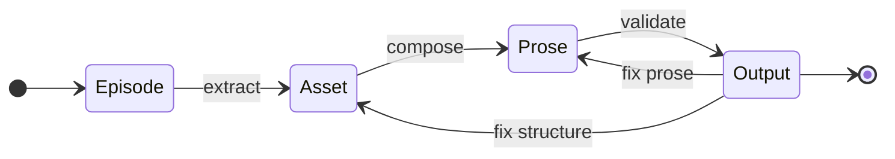

# PAPER

**The CANONIC WRITING MACHINE paper specification.**

This is the specification for the academic paper discovering best practices for writing CANONIC papers. PAPER.md is human-iterated and defines what this paper IS.

---

## Subject

This paper documents the **entire CANONIC MACHINE WRITING PAPER stack** - paradigm, validation engine, application, and use case working together.

**CANONIC** (paradigm) - Constitutional programming via constraints + triad + inheritance  
**MACHINE** (enforcement) - Canon enforcement on git state (domain-agnostic validation engine)  
**WRITING** (application) - 4-state writing FSM (Episode → Asset → Prose → Output)  
**PAPER** (use case) - Academic paper specified as a CANONIC artifact  
**PUBLISHING** (signal) - External publication surfaces (arXiv, journals, conferences, LinkedIn)

---

## System Architecture

This paper specifies the **minimal architecture** of the CANONIC system and uses that architecture as the narrative frame.

```mermaid
flowchart TB
  subgraph PARADIGM[CANONIC Paradigm]
    RC[Root CANON\n(invariants)]
    TR[Triad\n(CANON.md, VOCAB.md, README.md)]
    INH[Inheritance\n(declared lineage)]
    GOV[Governance\n(producer/consumer)]
  end

  subgraph MACHINES[CANONIC Machines]
    M1[MACHINE\n(enforce canon on git)]
    M2[WRITING\n(execute prose)]
    M3[PAPER\n(interpret evidence)]
    M4[PUBLISHING\n(emit signals)]
  end

  RC --> M1
  TR --> M1
  INH --> M1
  GOV --> M1

  M1 --> M2 --> M3 --> M4
  M4 -.signals.-> M2
  M4 -.signals.-> M3
```

### Stack ordering (maximal separation)

```mermaid
flowchart TB
  CANONIC[CANONIC\n(paradigm)] --> MACHINE[MACHINE\n(enforcement on git)]
  MACHINE --> WRITING[WRITING\n(application)]
  WRITING --> PAPER[PAPER\n(use case)]
  PAPER --> PUBLISHING[PUBLISHING\n(signal emitter)]

  PUBLISHING -.feedback signals.-> WRITING
  PUBLISHING -.feedback signals.-> PAPER
```

### Layer components (define every component)

#### CANONIC (paradigm)
- **Root CANON**: constitutional invariants that must not drift
- **Triad definition**: required governed artifacts (`CANON.md`, `VOCAB.md`, `README.md`)
- **Inheritance**: declared lineage across repos and directories (explicit paths)
- **Producer/consumer process**: governance change (producer) vs application (consumer)
- **Human iteration point**: `CANONIC.md` (specifying the paradigm, not executing it)

#### MACHINE (enforcement on git)
- **Validation gates**: accept/reject of proposed state changes based on CANONIC constraints
- **Git-FSM ledger**: git commits as the authoritative execution trace
- **Constraint checking**: domain-agnostic enforcement of structure + references + triad presence
- **Signals**: pass/fail/redo emitted via commit outcomes and commit taxonomy
- **Self-* claims (as evidence targets)**: self-documenting / self-measuring / self-healing (reported only when evidenced in git)

#### WRITING (application)
- **Episode**: real-time ungoverned session capture (raw signal)
- **Asset**: registered entities/claims extracted from episodes (structured, traceable)
- **Prose**: narrative composed only from registered assets (no orphan claims)
- **Output**: validated artifacts that exist only when compliant



#### PAPER (use case)
- **PAPER.md**: this specification (human-iterated)
- **Manuscript**: the paper text generated under this spec
- **Episode corpus**: the ordered set of real-time episodes used as evidence
- **Analyses**: measurements computed from git history (only if reproducible)
- **Best practices**: derived findings (must trace to evidence)

#### PUBLISHING (signal emitter)
- **Targets**: arXiv (v0), journals (peer review), conferences/talks, LinkedIn/blogs
- **Signals**: comments, critiques, citations, reviewer feedback (non-binding)
- **Feedback routing**: signals inform future WRITING + PAPER revisions (never override canon)

---

**The paper's purpose:** Discover best practices for writing CANONIC papers by analyzing our CANONIC interactions with the GIT MACHINE.

**Method:** Git-based evolutionary analysis combining:
- Episode chronology (AGENT drift tracking through narrative captures)
- Sentiment frequency analysis (emotional signals in episodes and corrections)
- Commit pattern analysis (producer/consumer frequencies, session boundaries)
- Constitutional amendment rate (producer commits to root CANON - proof of maturity as rate decreases)
- Layer commit distribution (graphing relative commits over CANONIC/MACHINE/WRITING/PAPER - maturity cascade as commits shift down stack)
- Understanding measurement (cleaner triads correlate with improved communication efficiency - fewer corrections, shorter episodes, faster drift→fixation, decreased sentiment frequency, higher first-pass compliance)
- Drift → fixation detection (AGENT learning through canonification)
- Re-canonization detection (rediscovered insights signal accessible, correct canon - cross-reference episodes with existing canon to validate completeness)
- **Git evolutionary analysis** (chronological producer→consumer commit pairs across repos reveal discovery patterns):
  1. Constitutional cascade (canonic → machine/writing)
  2. Cross-repo synchronization (parallel constraint canonification)
  3. Episode-driven compliance (episode → all repos update)
  4. Redo protocol (violation → redo → documentation)
  5. Generated file synchronization (canon → all READMEs/VOCABs)

**We don't know the best practices yet.** The paper discovers them through analysis of our own git history.

**Focus:**
- CANONIC paradigm (constraints, validation, triad, inheritance, producer/consumer)
- WRITING machine (4-state FSM, episodes/assets/prose/output)
- GIT MACHINE interactions (productive commits, consumptive commits)
- Constitutional governance (human governance, AI execution)
- Best practices extraction (what works, what fails, patterns that emerge)
- Real-time discovery (insights canonified as we write)
- Publishing as signal (arXiv + peer review + social feedback as non-binding inputs)

---

## Evidence Requirements

**All claims must trace to git history.**

The paper analyzes git commits from our actual CANONIC paper writing sessions.

Evidence sources:
- PAPER repository commits (this paper's writing sessions)
- WRITING repository commits (machine development)
- CANONIC repository commits (paradigm evolution)
- Constitutional amendments (producer commits to root CANON showing paradigm discoveries)
- Producer/consumer commit patterns (legislative process)
- Episodes (episodic memory of sessions)
- Constitutional violations and recoveries (governance in action)
- Maturity metrics computed from git log (evolution measurement)

**No hallucinated claims.** Every assertion must be verifiable by cloning repos and running git commands.

---

## Episodes (Real-Time Narrative Units)

**Episodes are the real-time narrative substrate of this paper.**

- Episodes are captured during live sessions.
- Episodes are treated as **ungoverned input** (raw signal), not polished narrative.
- One episode may span many commits across multiple repos.
- Episodes are ordered chronologically and referenced as primary evidence units.

**Episode rule:** the paper may describe what episodes contain, but best practices must be derived from git-traceable patterns observed across episodes.

---

## Structure

Standard academic paper structure:

1. **Abstract** - Contribution (best practices for CANONIC papers), methods (git analysis), findings  
2. **Introduction** - Problem (AI slop), solution (CANONIC stack), thesis (git interactions reveal best practices)  
3. **Model** - CANONIC paradigm (constraints, triad, inheritance, producer/consumer, git-FSM)  
4. **Implementation** - WRITING machine + GIT MACHINE interactions (how we govern the stack)  
5. **Results** - Best practices discovered through evolutionary analysis:  
   - Episodic drift tracking (AGENT learning visible in episode chronology)  
   - Sentiment frequency analysis (emotional signals: "Click", "??", "LFG", "brilliant")  
   - Commit frequency patterns (producer/consumer ratios, session boundaries)  
   - Constitutional amendment rate analysis (paradigm stabilization measured by decreasing producer commits to root CANON)  
   - Layer commit distribution (maturity cascade visualization - commits shift from CANONIC → MACHINE → WRITING → PAPER as stack matures)  
   - Understanding evolution (triad quality correlates with communication efficiency - episode length, correction cycles, sentiment signals, first-pass compliance rate)  
   - AGENT learning fixation (drift → correction → fixation pattern)  
   - Constitutional compliance evolution  
   - Maturity metrics from git  
   - Canonical locality  
   - Self-aware AGENT governance (asks USER before canonifying)  
6. **Discussion** - What works, what fails, patterns that emerged, implications  
7. **Conclusion** - Best practices summary, significance for CANONIC paper writing  
8. **References** - Citations to external work

---

## Publishing Plan (Future Work as Signals)

Publishing is treated as a **signal emitter**, not a governance authority.

**Planned releases:**
- **v0 (arXiv):** publish the initial manuscript focused on architecture + observational results from git history.
- **v1 (revision):** incorporate external commentary signals as new episodes and update the manuscript accordingly.

**Peer review plan:**
- Submit to a relevant venue after arXiv dissemination.
- Reviewer feedback is ingested as non-binding signals.
- Accepted revisions must remain traceable to episodes and git evidence.

**Social publishing (e.g., LinkedIn):**
- Used to attract expert comments.
- Treated as commentary signals (same class as informal review).

---

## Key Insights

**The paper must document these insights extracted from git history:**

**Paradigm layer (CANONIC):**
- Constitutional programming via constraints + validation
- Triad requirement (CANON, VOCAB, README - all LLM-generated)
- VOCAB is temporal (evolves with machine, not static dictionary)
- Specifications are human iteration points (CANONIC.md, WRITING.md, PAPER.md)
- Producer/consumer legislative process (maturity measurement)
- Inheritance (implementations inherit from paradigm)

**Machine layer (GIT MACHINE):**
- Git is a machine (not just storage)
- Atomic commits as critical infrastructure (FSM execution log)
- GitHub is the ledger (single source of truth)
- Git signal = FSM execution trace
- One episode spans many commits (producer + consumer sequences)

**Governance:**
- AI-driven, human-governed execution model (governor general metaphor)
- Constitutional compliance through git signal (violations visible, recoverable)
- Human governance catches AI drift (pattern blindness vs constitutional enforcement)
- Real-time canonification (insights captured during execution)

**Application layer (WRITING + PAPER):**
- 4-state FSM (Episode → Asset → Prose → Output)
- Episodes are ungoverned input (fleeting moments, episodic memory)
- Episodes captured in real-time during sessions
- Episodes track AGENT drift over time (temporal VOCAB for AGENT behavior)
- Canonical locality (artifacts placed closest to canon that governs them)
- Self-* properties (self-validating, self-documenting, self-healing, self-measuring, self-optimizing, self-strengthening)

**Best practices (discovered through evolutionary analysis):**
- Every session is an episode (capture fleeting moments)
- Episodes preserve drift signal (don't fix violations - they're learning evidence)
- Chronological episode analysis reveals AGENT evolution (drift → fixation pattern)
- Form vs governance (file existence ≠ compliance)
- Layer discipline (paradigm vs implementation vs domain)
- Meta-circular writing (paper documents its own creation)
- Backwards discovery (work from application to discover machine constraints)
- Four-repo evolution (CANONIC, MACHINE, WRITING, PAPER evolve together)
- Active learning (use the machine to discover what the machine needs)
- Precise VOCAB usage (most precise term prevents drift)

---

## Traceability

Every artifact reference must resolve:
- Repository links → must exist on GitHub
- Commit hashes → must exist in git history
- File paths → must exist at specified commits
- Git commands → must produce stated results
- Metrics → must be computable from git log
- Episodes → must trace to actual sessions

No broken links. No hallucinated references. Complete verifiability.

---

## Meta-Circular Properties

This paper:
- Documents best practices for CANONIC papers
- Is itself a CANONIC paper
- Discovers best practices by analyzing its own writing
- Captures episodes from its own sessions
- Canonifies insights discovered during writing
- Validates its own claims against its own git history
- Demonstrates every pattern it describes

**The paper IS the experiment.** We analyze our CANONIC interactions with the GIT MACHINE to discover what works.

---

**This is the specification. PAPER.md is the human iteration point. CANON.md regenerates from this source.**
