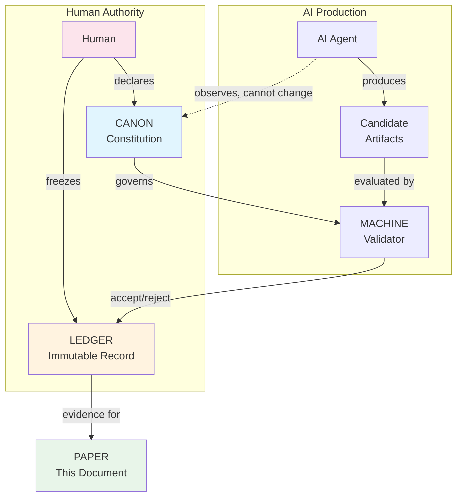
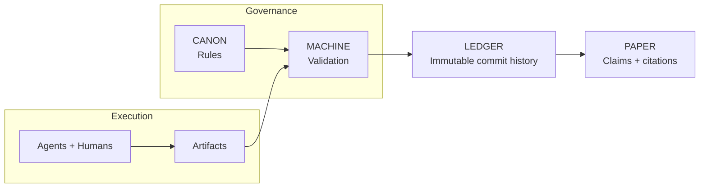
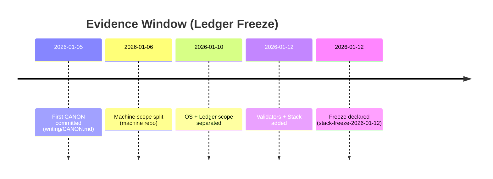

# We Made an AI Write a Paper It Can't Lie About

**Dexter Hadley**

---

## Abstract

What if an AI could not bullshit its way through scientific prose - not because it chose not to, but because the system made unsupported claims inadmissible?

In ledger notes we called the failure mode "AI bullshit"; in this paper we use the more formal term **slop**. We built CANONIC, a governance framework where claims must trace to a ledger, every term used in rules must be defined, and the AI cannot promote its own ideas to law. Across 129 recorded episodes at `stack-freeze-2026-01-12`, we observed recurring failures (undefined terms, evidence gaps, governance leakage) and the corrections that followed.

The result is this paper. It does not describe an experiment. It is the experiment. Key claims link to evidence references (commits, tags, episodes) so you can verify them yourself.

We asked whether a governed human-AI system could produce a self-evidencing scientific paper. You are reading the answer.

---

## The Problem: AI Slop Is Eating Scientific Writing

LLMs are everywhere in research now. And they're great - until they're not.

The failure mode has a name: **slop**. It's text that sounds authoritative but means nothing. Undefined terms. Unverifiable claims. Confident fabrications. The AI equivalent of a student padding an essay.

Current defenses don't work:

- **Detection tools** are unreliable and easily fooled
- **Disclosure policies** are unverifiable ("I used AI responsibly" proves nothing)
- **Human review** catches slop but doesn't prevent it

We wanted something different: a system where slop-like failure modes are structurally inadmissible to the ledger. Not filtered out. Invalid by construction.

---

## The Idea: Constitutional AI Governance

The insight is simple: treat AI collaboration like a legal system.

A constitution defines what's valid. A ledger records what happened. Courts (validators) check compliance. And crucially: the AI can observe and propose, but only humans can change the rules.

Figure 1 sketches the governance loop.



We call the framework CANONIC. In the frozen stack it relies on seven governance primitives.

### Ledger-as-evidence pipeline

The pipeline below shows how rules become evidence and claims.



### 1. Triad

Every scope needs three files: `CANON.md` (rules), `VOCAB.md` (definitions), `README.md` (description). Missing any = invalid.

### 2. Inheritance

Rules flow from a root constitution. You can add constraints downstream, but you cannot override upstream rules.

### 3. Introspection

Every term used in the rules must be defined. If CANON says "episode," VOCAB must define "episode." Undefined jargon = invalid scope.

### 4. Immutability (governed)

The ledger is treated as immutable. Corrections happen via new commits; history rewriting is disallowed by governance.

### 5. Model identity disclosure (best practice)

Sessions SHOULD record the actual model identity. This was not consistently captured early and is documented as a limitation (see Limitations).

### 6. Ledger-first evidence

Claims without evidence references are inadmissible. "The system achieved compliance" means nothing unless you can point to the commit where it happened.

### 7. Insight-law separation

The AI can discover patterns and propose ideas. But those insights have zero legal force until a human explicitly adds them to CANON.

---

## What We Actually Did

We built the system across the public CANONIC stack:

| Repo | Purpose |
|------|---------|
| canonic | Root constitution |
| machine | Execution semantics |
| os | Authority bounds |
| ledger | Immutability rules |
| writing | Episode production |
| paper | This paper's governance |
| stack | Multi-system composition |
| validators | Enforcement outcomes (public) |
| patents | Disclosures and governance IP |
| publishing | Submission and dissemination artifacts |

Enforcement outcomes are recorded in the ledger; validator implementations may be public or private.

Publishing is a post-freeze dissemination scope and is not part of the freeze evidence window.

### Evidence window

Pre-freeze evidence is anchored at tag `stack-freeze-2026-01-12` (tag timestamp `2026-01-12T18:34:47-05:00`, commit `writing:f8acf128`). All counts and timestamps in this manuscript are computed from that tag. Post-freeze revisions are marked as reconstruction.

### From single scope to multi-repo

Figure 2 shows how the single-scope system expanded into a multi-repo stack.

```mermaid
flowchart LR
    canonic[canonic\n(root CANON)] --> machine[machine\n(exec semantics)]
    machine --> os[os\n(authority bounds)]
    os --> writing[writing\n(episodes)]
    writing --> paper[paper\n(epistemic reconstruction)]

    canonic --> ledger[ledger\n(immutability rules)]
    canonic --> stack[stack\n(multi-repo composition)]
    canonic --> validators[validators\n(enforcement)]
    canonic --> patents[patents\n(disclosures)]

    stack -.-> canonic
    stack -.-> machine
    stack -.-> os
    stack -.-> writing
    stack -.-> paper
    stack -.-> ledger
```

At `stack-freeze-2026-01-12`, the writing repo contains 129 episode artifacts in `writing/episodes/` documenting human-AI collaboration. When applicable, episodes record:

- Explicit model disclosure
- Commit-linked evidence
- Documented violations and corrections

The system evolved through recorded revisions. By the freeze tag, the root CANON in `canonic` contains three axioms, and each scope's vocabulary is defined in its own `VOCAB.md`. Episodes ep019, ep053, and ep060 document the compression path.

On January 12, 2026, we froze the ledger:

> "I declare that all SPEC evolution across the CANONIC stack is complete and stable... This declaration constitutes human fixation." - Dexter Hadley

The timeline below anchors the evidence window.



The first CANON artifact in the stack is `writing/CANON.md` at `2026-01-05T14:13:20-05:00` (`writing:bca9ec0`). The freeze declaration at `stack-freeze-2026-01-12` (`writing:f8acf128`, tag timestamp `2026-01-12T18:34:47-05:00`) occurred **7 days, 4:21:27** later.

Everything at or before the freeze is evidence. Everything after is reconstruction.

---

## Results: Observations at Freeze

At freeze, the triad compliance report lists 12 triad scopes across 9 repositories (see `writing/episodes/ep136-stack-compliance-reports.md`).

Each listed scope contains CANON, VOCAB, and README at the freeze tag.

### The Violation Record

At freeze, 33 episodes are explicitly labeled as violations by filename (`writing/episodes/*violation*`).

Every violation was:
1. Detected (mechanically or by review)
2. Documented (in an episode)
3. Corrected (via new commit, never revision)

The violations are features, not bugs. They show the system catches problems and preserves the learning process.

### The Compression

Governance shrank by iteration. Root axioms were reduced to three, and vocabularies stabilized at scope level. The change is visible across the refactoring, minimalism, and fixed-point episodes (ep019, ep053, ep060).

---

## Evidence Links (Key Claims)

| Claim | Evidence reference |
|-------|--------------------|
| "129 episode artifacts" | `writing/episodes/` file count at tag `stack-freeze-2026-01-12` |
| "33 violation-labeled episodes" | `writing/episodes/*violation*` file count at tag `stack-freeze-2026-01-12` |
| "12 triad scopes across 9 repos" | `writing/episodes/ep136-stack-compliance-reports.md` (Report A) |
| "First CANON timestamp" | `writing/CANON.md` initial commit `writing:bca9ec0` |
| "Freeze timestamp" | tag `stack-freeze-2026-01-12` (tag timestamp `2026-01-12T18:34:47-05:00`, commit `writing:f8acf128`) |

You do not have to trust us. Clone the repos. Replay the history. The evidence is the system that produced the evidence.

Traditional papers describe experiments that happened elsewhere. This paper is the experiment it describes. The method, results, and limitations all derive from the same ledger.

---

## Why This Matters

### For Scientific Publishing

If this approach generalizes, papers could be verifiable by construction. Instead of "trust the authors," check the ledger.

Peer review could become: "Does every claim link to evidence? Do the commits exist? Is the governance valid?" Mechanical verification replaces subjective trust.

### For AI Collaboration

The framework improves attribution when model identity is recorded: which model, which session, which commits.

It also clarifies authority. The AI can contribute, but it cannot change the rules. Insight-law separation keeps governance human.

### For AI Slop

The primitives target slop-like failure modes by making them invalid to commit:

| Primitive | What It Blocks |
|-----------|----------------|
| Triad | Incomplete scopes |
| Inheritance | Invented authority |
| Introspection | Undefined jargon |
| Immutability | Polished-away mistakes |
| Model disclosure | Anonymous AI |
| Ledger-first | Unsupported claims |
| Insight-law separation | AI self-promotion |

This is not a filter. It is a governance boundary.

---

## Limitations (Honest Ones)

We do not claim:

- **Optimality**: These seven primitives work here. Fewer might suffice.
- **Generalizability**: This worked for governance specs. Other domains may differ.
- **Scalability**: 9 public repos, 129 episode artifacts at `stack-freeze-2026-01-12`. Enterprise scale is unproven.
- **Model-identity completeness**: Some early episodes lack explicit model IDs; this gap is documented post-freeze in ep135.

The study is bounded by one frozen ledger. Claims are observations within that window.

---

## Try It Yourself

The system is in the ledger. Clone it. Check compliance. Trace any claim to its commit.

```
# Example: writing repo evidence

git clone https://github.com/canonic-machine/writing.git
cd writing
git checkout stack-freeze-2026-01-12
```

For the full stack list, see `stack/public/STACK.yml` in the stack repo.

---

## Conclusion

We asked: can a governed human-AI system produce a self-evidencing scientific paper?

Within this evidence window, the answer is yes.

Seven primitives. 129 episode artifacts. One frozen ledger. Key claims trace to evidence. Every correction is preserved.

Constitutional governance makes verifiability structural, not procedural. The paper does not just report an experiment - it is the experiment, and you can replay it.

---

## Evidence

**Evidence window:** `stack-freeze-2026-01-12` (tag timestamp `2026-01-12T18:34:47-05:00`, commit `writing:f8acf128`)

**First CANON artifact:** `writing/CANON.md` commit `writing:bca9ec0` at `2026-01-05T14:13:20-05:00`

**Time to freeze:** 7 days, 4:21:27 (from first CANON to freeze tag timestamp)

**Public repositories** (tagged at `stack-freeze-2026-01-12`):
- canonic:0b063b8
- machine:a57f159
- os:4c2919d
- ledger:3b95de2
- writing:f8acf12
- paper:0ee1970
- stack:f58ad6d
- validators:e772048
- patents:4bd3dd0

**Key episodes**: ep019 (refactoring), ep053 (root minimalism), ep060 (minimal axioms), ep131 (full stack triad compliance)

**Post-freeze corrections (not part of the evidence window)**: ep135 (model identity gap)

**Freeze declaration**: Dexter Hadley, 2026-01-12

---

*This revision was produced under CANONIC governance using OpenAI Codex (GPT-5).*
*Model: gpt-5 (Codex CLI)*
*Key claims trace to the frozen ledger.*

---
