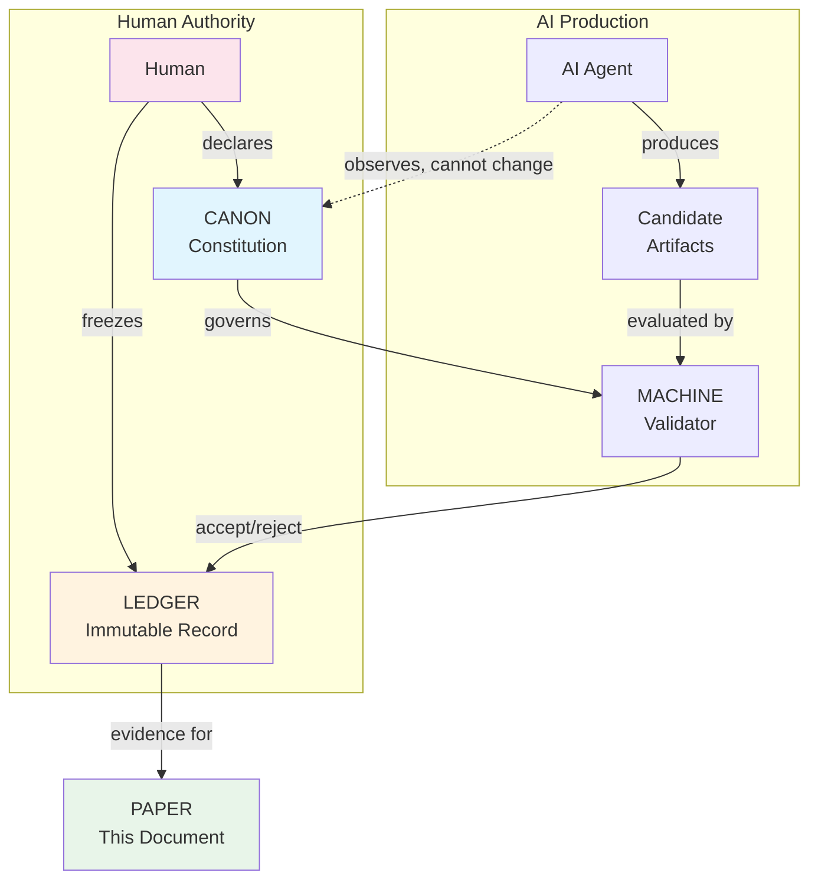
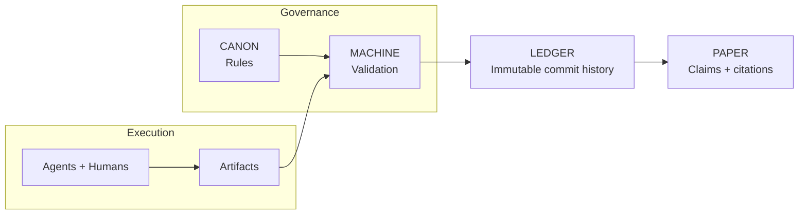
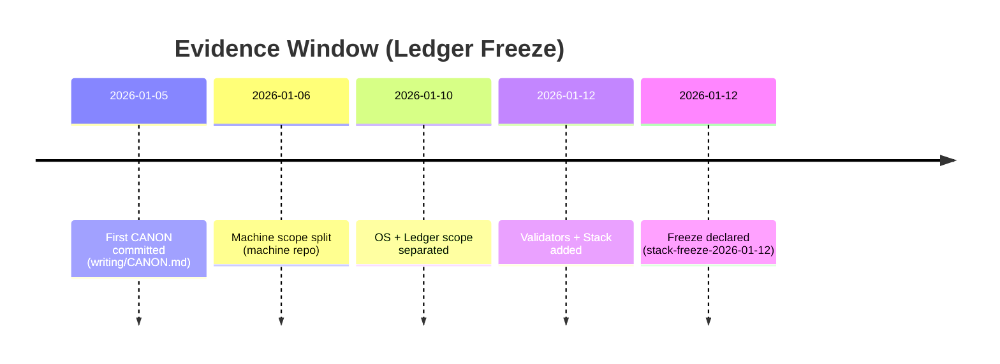

# We Made an AI Write a Paper It Can't Lie About

**Dexter Hadley**

---

## Abstract

What if an AI couldn't bullshit you—not because it chose not to, but because the system made it structurally impossible?

We built CANONIC, a governance framework where every claim traces to an immutable ledger, every term must be defined, and the AI cannot promote its own ideas to rules. Across 129 recorded episodes (stack-freeze-2026-01-12), we discovered that seven simple constraints eliminate "AI slop"—that confident-sounding garbage LLMs produce when they hallucinate or hand-wave.

The result: this paper. It doesn't describe an experiment. It *is* the experiment. Every claim links to a commit. Every commit is immutable. You can verify everything yourself.

The punchline: we asked whether a governed human–AI system could produce a self-evidencing scientific paper. You're reading the answer.

---

## The Problem: AI Slop Is Eating Scientific Writing

LLMs are everywhere in research now. And they're great—until they're not.

The failure mode has a name: **slop**. It's text that sounds authoritative but means nothing. Undefined terms. Unverifiable claims. Confident fabrications. The AI equivalent of a student padding an essay.

Current defenses don't work:

- **Detection tools** are unreliable and easily fooled
- **Disclosure policies** are unverifiable ("I used AI responsibly" proves nothing)
- **Human review** catches slop but doesn't prevent it

We wanted something different: a system where slop is *structurally inadmissible*. Not filtered out. Impossible to create.

---

## The Idea: Constitutional AI Governance

The insight is simple: treat AI collaboration like a legal system.

A constitution defines what's valid. A ledger records what happened. Courts (validators) check compliance. And crucially: the AI can observe and propose, but only humans can change the rules.



We call the framework CANONIC. It has seven primitives:

### Ledger-as-evidence pipeline



### 1. Triad

Every scope needs three files: `CANON.md` (rules), `VOCAB.md` (definitions), `README.md` (description). Missing any = invalid. You can't publish half-baked work.

### 2. Inheritance

Rules flow from a root constitution. You can add constraints downstream, but you can't override upstream rules. No rogue AI inventing its own laws.

### 3. Introspection

Every term used in the rules must be defined. If CANON says "episode," VOCAB must define "episode." Undefined jargon = invalid scope. No hand-waving.

### 4. Immutability

The ledger (git) cannot be rewritten. Made a mistake? Create a new commit. You can't polish away your errors. The mess is part of the record.

### 5. Model Disclosure

Every session must name the actual model: "Claude Opus 4.5," not "AI assistant." No hiding behind abstractions.

### 6. Ledger-First Evidence

Claims without commits are inadmissible. "The system achieved compliance" means nothing unless you can point to the commit where it happened.

### 7. Insight–Law Separation

The AI can discover patterns and propose ideas. But those insights have zero legal force until a human explicitly adds them to CANON. The AI cannot escalate its own observations to rules.

---

## What We Actually Did

We built the system across the public CANONIC stack:

| Repo | Purpose |
|------|---------|
| canonic | Root constitution |
| machine | Execution semantics |
| os | Authority bounds |
| ledger | Immutability rules |
| writing | Episode production |
| paper | This paper's governance |
| stack | Multi-system composition |
| validators | Enforcement outcomes (public) |
| patents | Disclosures and governance IP |
| publishing | Submission and dissemination artifacts |

Enforcement outcomes are recorded in the ledger; validator implementations may be public or private.

Publishing is a post-freeze dissemination scope and is not part of the freeze evidence window.

### From single scope to multi-repo

```mermaid
flowchart LR
    canonic[canonic\n(root CANON)] --> machine[machine\n(exec semantics)]
    machine --> os[os\n(authority bounds)]
    os --> writing[writing\n(episodes)]
    writing --> paper[paper\n(epistemic reconstruction)]

    canonic --> ledger[ledger\n(immutability rules)]
    canonic --> stack[stack\n(multi-repo composition)]
    canonic --> validators[validators\n(enforcement)]
    canonic --> patents[patents\n(disclosures)]

    stack -.-> canonic
    stack -.-> machine
    stack -.-> os
    stack -.-> writing
    stack -.-> paper
    stack -.-> ledger
```

Then we used it. At the `stack-freeze-2026-01-12` tag, the writing repo contains 129 episode artifacts in `writing/episodes/` documenting human–AI collaboration. When applicable, episodes record:

- Explicit model disclosure
- Commit-linked evidence
- Documented violations and corrections

The system evolved. Early versions were bloated—20+ axioms, 50+ vocabulary terms. Through iterative refinement (all recorded), we compressed to a minimal fixed point: 3 root axioms, ~10-15 terms per scope.

On January 12, 2026, we froze the ledger:

> "I declare that all SPEC evolution across the CANONIC stack is complete and stable... This declaration constitutes human fixation." — Dexter Hadley



The first CANON artifact in the stack was committed in `writing/CANON.md` at `2026-01-05T14:13:20-05:00` (`writing:bca9ec0`). The freeze declaration at `stack-freeze-2026-01-12` (`writing:f8acf128`) occurred **7 days, 4:21:27** later.

Everything at or before the freeze is evidence. Everything after (including this revision) is reconstruction.

---

## Results: It Works

At freeze, the system achieved triad compliance across the stack:

**12 triad scopes across 9 repositories** (`paper/TRIAD_COMPLIANCE.md` at `stack-freeze-2026-01-12`).

Each listed scope contains CANON, VOCAB, and README at the freeze tag.

### The Violation Record

At freeze, 33 episodes are explicitly labeled as violations by filename (`writing/episodes/*violation*`):

- Missing VOCAB files (most common)
- Undefined terms in CANON
- Governance in wrong layer
- AI attempting to canonify without human approval

Every violation was:
1. Detected (mechanically or by review)
2. Documented (in an episode)
3. Corrected (via new commit, never revision)

The violations are features, not bugs. They prove the system catches problems. And because corrections happen through new commits rather than rewrites, the learning process is preserved.

### The Compression

| Metric | Start | End |
|--------|-------|-----|
| Root axioms | 20+ | 3 |
| Terms per scope | 50+ | 10-15 |
| Compliance | Partial | Full |

The system discovered its own minimal form through governed iteration.

---

## The Self-Evidencing Property

Here's the weird part: this paper proves itself.

| Claim | Verification |
|-------|--------------|
| "12 triad scopes compliant" | See `paper/TRIAD_COMPLIANCE.md` at tag `stack-freeze-2026-01-12` |
| "129 episodes (stack-freeze-2026-01-12)" | Count files matching `writing/episodes/ep*` at tag `stack-freeze-2026-01-12` |
| "33 violation-labeled episodes" | Grep episode filenames for `violation` at `stack-freeze-2026-01-12` |
| "Ledger frozen Jan 12" | Check git tag `stack-freeze-2026-01-12` |

You don't have to trust us. Clone the repos. Replay the history. The evidence is the system that produced the evidence.

Traditional papers describe experiments that happened elsewhere. This paper *is* the experiment it describes. The method, results, and limitations all derive from the same ledger.

---

## Why This Matters

### For Scientific Publishing

If this approach generalizes, papers could be verifiable by construction. Not "trust the authors"—*check the ledger*.

Peer review becomes: "Does every claim link to evidence? Do the commits exist? Is the governance valid?" Mechanical verification replaces subjective trust.

### For AI Collaboration

The framework solves attribution precisely. Not "AI-assisted"—*which model, which session, which commits*.

And it solves the authority problem. The AI can contribute massively, but it cannot change the rules. Insight–law separation means human governance remains human.

### For AI Slop

The seven primitives make slop inadmissible:

| Primitive | What It Kills |
|-----------|---------------|
| Triad | Incomplete work |
| Inheritance | Invented authority |
| Introspection | Undefined jargon |
| Immutability | Polished-away mistakes |
| Model disclosure | Anonymous AI |
| Ledger-first | Fabricated claims |
| Insight–law separation | AI self-promotion |

This isn't filtering slop. It's making slop impossible to commit.

---

## Limitations (Honest Ones)

We don't claim:

- **Optimality**: These seven primitives work. Fewer might suffice.
- **Generalizability**: This worked for governance specs. Other domains may differ.
- **Scalability**: 9 public repos, 129 episode artifacts at `stack-freeze-2026-01-12`. Enterprise scale is unproven.
- **Model-independence**: Multiple models and agents were used; post-freeze sampling is small.

The study is bounded by one frozen ledger. Claims are observations, not universal laws.

---

## Try It Yourself

The entire system is in the ledger. Clone it. Check compliance. Trace any claim to its commit.

```
git clone [repo] && git checkout stack-freeze-2026-01-12
```

The paper isn't asking you to believe anything. It's showing you the evidence and inviting you to verify.

---

## Conclusion

We asked: can a governed human–AI system produce a self-evidencing scientific paper?

The answer is yes. You're reading it.

Seven primitives. 129 episode artifacts. One frozen ledger. Every claim traceable. Every term defined. Every correction preserved.

The AI contributed substantially. But it couldn't lie, because lies don't compile. Undefined terms fail introspection. Unverifiable claims fail ledger-first. Invented authority fails inheritance.

Constitutional governance makes verifiability structural, not procedural. The paper doesn't just report an experiment—it *is* the experiment, and you can replay it.

---

## Evidence

**Public repositories** (`stack-freeze-2026-01-12`):
- canonic:0b063b8
- machine:a57f159
- os:4c2919d
- ledger:3b95de2
- writing:f8acf12
- paper:0ee1970
- stack:f58ad6d
- validators:e772048
- patents:4bd3dd0

Enforcement repositories are private; their outcomes are observable in the ledger.

**Key episodes**: ep000 (initial), ep019 (refactoring), ep053 (minimalism), ep060 (fixed point), ep131 (full compliance)

**Freeze declaration**: Dexter Hadley, 2026-01-12

---

*This paper was produced under CANONIC governance using Claude Opus 4.5.*
*Model: claude-opus-4-5-20251101*
*All claims trace to the frozen ledger.*

---
