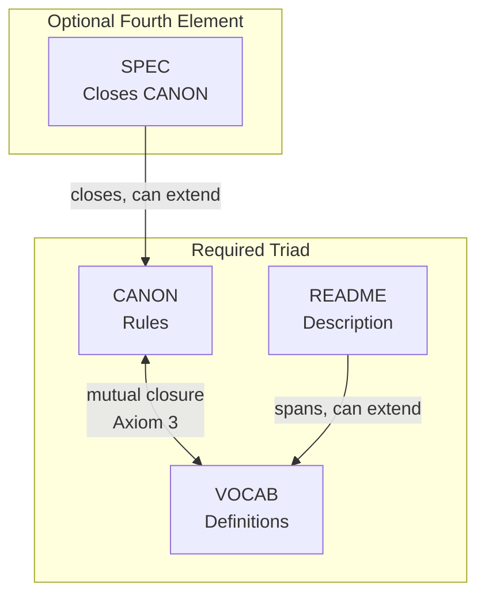
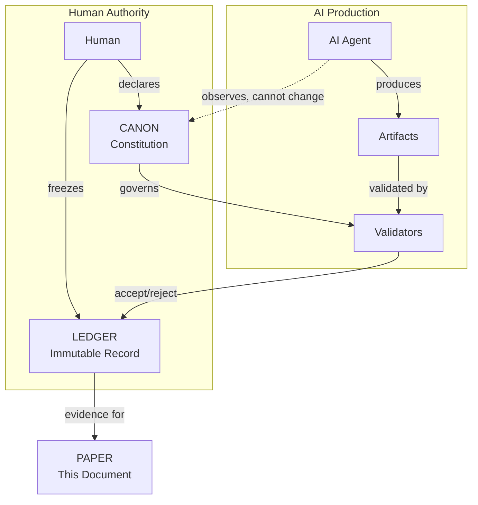
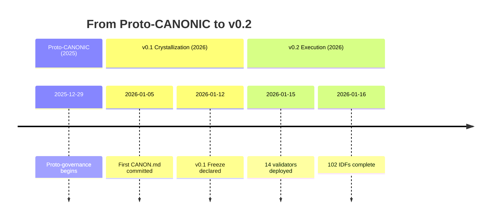
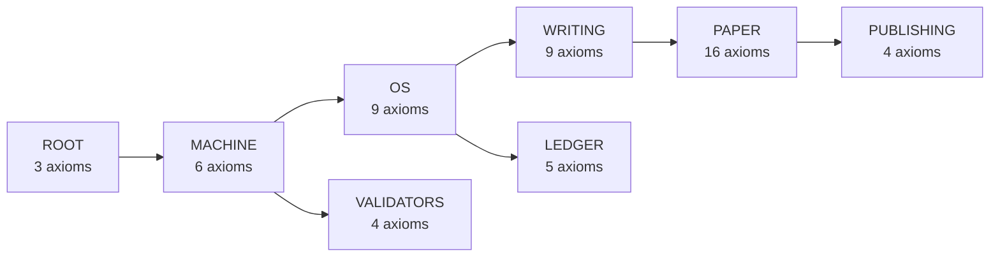

# We Made an AI Write a Paper It Can't Lie About

**Dexter Hadley**

---

## Abstract

What if an AI could not bullshit its way through scientific prose—not because it chose not to, but because the system rendered unsupported claims inadmissible? We call this failure mode **AI slop**.

CANONIC is the governance framework we built to make AI slop structurally inadmissible. Claims must trace to a ledger; every term used in rules must be defined; the AI cannot promote its own ideas to law.

This paper spans two evidence windows. At v0.1 freeze, we observed 129 episodes and 33 violations across 9 repositories. Post-freeze (v0.2), the system evolved to 164 episodes, 104 IDFs, and 16 deployed validators across 54 governed scopes.

The result is this paper. It does not describe an experiment. It is the experiment. Every claim cites evidence so you can verify it yourself.

**The deeper insight:** This paper is an evolutionary analysis of law and prose. Under constitutional constraint, governance axioms (law) and scientific claims (prose) co-evolve—each drift in one domain reveals structure in the other. The violations are not bugs; they are the fossil record of this co-evolution.

---

## Why Should You Care?

> "Help me understand what this is for." — Fatima Boukrim

AI writes convincingly. It also makes things up.

When your doctor uses AI to summarize research, you want that summary to be true. When a scientist uses AI to draft a paper, you want the claims to be real. When policy is shaped by AI-assisted analysis, you want the evidence to exist.

Right now, you have to trust. Trust the author checked. Trust the AI didn't hallucinate. Trust the peer reviewers caught the errors.

We built a system where you don't have to trust. You can verify.

Every claim in this paper links to a commit. Every commit is in a public ledger. Clone the repos. Check for yourself. The evidence is the system that produced the evidence.

---

## The Problem: AI Slop Is Eating Scientific Writing

LLMs are everywhere in research. Powerful—until they are not.

The failure mode has a name: **AI slop**. Reads as authoritative, means nothing. Undefined terms, unverifiable claims, confident fabrications. The AI equivalent of padding an essay.

Current defenses fail:

- **Detection tools** are unreliable and easily fooled
- **Disclosure policies** are unverifiable ("I used AI responsibly" proves nothing)
- **Human review** catches AI slop but does not prevent it

We wanted something different: a system where AI slop is structurally inadmissible—invalid by construction, not filtered out. So we built one.

---

## The Idea: Constitutional AI Governance

The insight is simple: treat AI collaboration like a legal system.

The root primitive is the **Triad**—`CANON.md`, `VOCAB.md`, and `README.md`. Every governed scope requires these three files. Optionally, **SPEC** (named `CANONIC.md` at root, `PAPER.md` for paper) closes the CANON and can extend it with generation details.



The closure relationships derive from Axiom 3 (Introspection):
- **CANON ↔ VOCAB**: Mutual closure (Axiom 3 constrains both)
- **README → VOCAB**: Spans VOCAB but can extend with new terms
- **SPEC → CANON**: Closes CANON but can extend with generation details

SPEC is optional but when present defines the paradigm. This four-element model was formalized in IDF-116.

With the closure in place, a constitution defines validity, a ledger records what happened, and validators check compliance. Crucially, the AI can observe and propose, but only humans can change the rules.

We call the framework CANONIC. It rests on three root axioms:

**1. Triad** — Every scope MUST contain `CANON.md`, `VOCAB.md`, and `README.md`. Missing any renders the scope invalid.

**2. Inheritance** — Every CANON MUST declare what it inherits from. Inherited axioms are final and MUST NOT be overridden.

**3. Introspection** — VOCAB MUST define every concept used by CANON and by VOCAB itself. Undefined concepts render the scope invalid.

These three axioms generate the entire constitutional structure. Every downstream axiom is either a specialization or a boundary declaration. (See Appendix A1 for full axiom text.)

### CANONIC as a Formal Language

A key insight emerged during v0.2: **CANONIC is not just a framework—it is a formal specification language.**

```
CANONIC (Language)          VaaS (Runtime)
─────────────────          ──────────────
Specification              Enforcement
Documents                  Validators
Grammar                    Interpreter
Open/Public                Licensed/Private
```

The validity of any scope is mathematically defined:

```
VALIDITY = triad(scope) ∧ inheritance(scope) ∧ introspection(scope)
```

Validators are predicates that map scopes to truth values. Composition is conjunction. Exit code 0 = PASS (true). Exit code non-zero = FAIL (false).

This framing has commercial implications: the language specification can be open while the enforcement runtime (VaaS—Validators as a Service) is the product. See IDF-122 (CANONIC Language Semantics) and IDF-123 (VaaS Product Architecture).

### The Governance Loop



This loop explains why authority stays human while execution can scale. Validators enforce the constitution; the ledger preserves evidence; the paper reconstructs what happened.

---

## What We Actually Did

We built the system across 10 public repositories with 54 governed scopes. The full repository list and axiom counts appear in Supplement S1.

The system did not start as ten repositories. It started as a book. On December 29, 2025, we began writing *Dividends & Deaths* and created proto-governance artifacts: `CANNON.md` (note the double N), `VOCABULARY.md`, and the Triad concept.

Within one week of the new year, the kernel crystallized. Proto-CANONIC became CANONIC. By v0.1 freeze on January 12, 2026, the stack had grown to 9 repositories with 12 triad-compliant scopes.



**Evidence:** Timeline details in Supplement S2.

### Inheritance Architecture



Rules flow from root; constraints accumulate; no downstream scope can override its parent.

---

## Results: Drift Analysis

We performed a complete closure analysis across all three root axioms. The results reveal where drift occurs and how it manifests.

### Axiom 1: Triad Closure

**Definition:** Every scope MUST contain CANON.md, VOCAB.md, README.md.

| Metric | Count |
|--------|-------|
| Total scopes analyzed | 54 |
| Fully compliant | 53 |
| Violations | 1 |
| **Compliance** | **98.1%** |

**The violation:** `validators/gap-validator` contains CANON.md and README.md but lacks VOCAB.md—an incomplete scope.

**Evidence:** `find . -name "CANON.md" | wc -l` across all repos.

---

### Axiom 2: Inheritance Closure

**Definition:** Every CANON MUST declare inheritance; inherited axioms are final.

| Metric | Count |
|--------|-------|
| Scopes with declared inheritance | 54/54 (100%) |
| Scopes with verifiable parent scope | 24/54 (44.4%) |
| Scopes with compound paths | 30/54 (55.6%) |
| Axiom override violations | 0 |

**The structural gap:** 30 scopes declare inheritance from compound paths (e.g., `/canonic/machine/os/writing`) that represent a *logical* governance hierarchy but don't correspond to actual filesystem directories. This is intentional—the inheritance architecture is semantic, not physical—but creates a validation gap.

**Example:** `paper/CANON.md` inherits from `/canonic/machine/os/writing`, a path that exists logically but not as a single directory containing CANON.md.

---

### Axiom 3: Introspection Closure

**Definition:** VOCAB MUST define every concept used by CANON and VOCAB itself.

| Metric | Count |
|--------|-------|
| Scopes with complete introspection | 34 |
| Scopes with undefined concepts | 19 |
| Total undefined concepts | 59 |
| **Closure** | **63.0%** |

**Pattern:** Violations cluster in two categories:

1. **Domain-specific terms** (regulatory, business): `companies/onconex/eu` references GDPR, MDR, EU AI Act without defining them.
2. **Core axiom names**: `paper/`, `publishing/` reference "Triad", "Inheritance", "Introspection" without local VOCAB definitions.

The second category reveals an architectural question: should downstream scopes re-define inherited concepts, or inherit VOCAB?

**Evidence:** Introspection-validator output across all 54 CANON.md files.

---

### Drift Type Analysis

We identified eight distinct drift patterns:

| Drift Type | Instances | Violation? | Status |
|------------|-----------|-----------|--------|
| **Layer drift** | 5 | Yes | Remediated (IDF-096) |
| **Axiom bloat** | 58 axioms (29%) | Yes | Validator deployed (IDF-102) |
| **Automation drift** | 14+ scopes | No | Bounded by axioms |
| **Vocabulary drift** | 19 scopes | Partial | Closure validator deployed |
| **Protocols-to-patents drift** | 100% conversion | No | Structural phenomenon |
| **Bootstrapping drift** | Multiple scopes | No | Phase transitions formalized |
| **Inheritance path drift** | 30 scopes | Partial | Standardization debt |
| **Manuscript drift** | 4 concept shifts | No | Disclosed (IDF-103) |

---

### Layer Drift (IDF-096)

**Definition:** When a scope exceeds its layer purpose.

The root CANON contained 8 axioms at v0.1. Analysis revealed 5 were layer violations:

| Axiom | Violation Type | Proper Layer |
|-------|---------------|--------------|
| Repository licensing | Procedural | OS |
| Root minimalism | Meta-referential | None (self-violating) |
| VOCAB closure | Permissive guidance | TEMPLATES |
| Layer discipline | Meta-referential | None (self-violating) |
| Lifecycle documentation | Guidance | TEMPLATES |

**Remediation:** Root CANON compressed to pure 3-axiom form. Commit `canonic:24d1b4b`.

**Insight:** Meta-axioms like "Root minimalism" violate themselves by existing. IDF-096 formalizes this as a validator.

---

### Axiom Bloat Drift (IDF-102)

**Definition:** Re-declaration of inherited axioms, violating inheritance finality.

| Metric | Before | After | Removed |
|--------|--------|-------|---------|
| paper/CANON.md | 16 axioms | 14 axioms | Triad, Inheritance, Introspection |
| publishing/CANON.md | 7 axioms | 4 axioms | Triad, Inheritance, Introspection |
| writing/episodes/CANON.md | 5 axioms | 3 axioms | Immutability, Non-authority |

**Total bloat:** 58 axioms (29% of 197) were redundant re-declarations.

**Evidence:** `validators/axiom-bloat-validator/validate.py`

---

### Automation Drift

**Definition:** Trajectory from human-governed to AI-assisted execution.

Every CANON.md with a Lifecycle section declares its automation trajectory:

| Scope | Current State | Drift Bound |
|-------|--------------|-------------|
| WRITING | AI-assisted | Axiom 6 (Human episode authority) |
| PATENTS | AI-assisted discovery | Human fixation required |
| CANONIC | AI-assisted validation | Axiom definition stays human |
| STACK | AI-assisted validation | Membership authority stays human |

**Insight:** Automation drift is bounded by axioms. Each scope declares what AI may automate and what must stay human. The bounds are constitutional, not technical.

---

### v0.1 vs v0.2 Evolution

| Metric | v0.1 | v0.2 | Delta |
|--------|------|------|-------|
| Episodes | 129 | 164 | +35 |
| Violations documented | 33 | 40 | +7 |
| CANON files | 12 | 54 | +42 |
| IDFs | 52 | 104 | +52 |
| Validators | 0 | 16 | +16 |
| Root axioms | 3 | 3 | 0 |

**Key observation:** Root axioms stayed constant while downstream complexity grew 4x. This validates the constitutional model: stable foundation, extensible specialization.

---

## The Evolutionary Analysis: Law and Prose Co-Evolve

The drift patterns reveal something unexpected: **law and prose are not separate artifacts—they co-evolve under constraint.**

### The Co-Evolution Pattern

When we write a CANON axiom (law), we implicitly constrain what the manuscript (prose) can claim. When we write a claim in the manuscript, we often discover that the axiom is incomplete, redundant, or misplaced. The correction requires updating both.

| Drift Type | Law Effect | Prose Effect |
|------------|-----------|--------------|
| Layer drift | Axioms in wrong scope | Claims cite wrong authority |
| Axiom bloat | Redundant governance | Redundant citations |
| Vocabulary drift | Undefined terms in CANON | Undefined terms in manuscript |
| Inheritance path drift | Structural debt | Citation path complexity |

**Example:** The root CANON originally contained "Root minimalism"—an axiom that *is itself* a minimalism violation. Detecting this required *writing about it* in the manuscript, which forced us to confront the self-contradiction. The prose revealed the law's error.

### Evolutionary Pressure

Constitutional constraint creates selection pressure:

1. **Inadmissibility** filters out claims that can't trace to evidence
2. **Introspection** filters out terms that aren't defined
3. **Inheritance finality** filters out redundant axioms

The surviving claims and axioms are those that satisfy all constraints simultaneously. This is evolution by structural inadmissibility.

### The Fossil Record

Violations are the fossil record of this evolution:

- **40 violation-labeled episodes** document claims that were initially inadmissible
- **58 bloated axioms** document governance that was initially redundant
- **5 layer violations** document authority that was initially misplaced

Each violation is a failed mutation. The corrections are adaptations. The ledger preserves the entire phylogeny.

### Why This Matters

Traditional scientific writing separates method (how we did it) from results (what we found). Constitutional governance unifies them:

- The **method** is the governance system (CANON, VOCAB, validators)
- The **results** are the drift patterns detected by that system
- The **paper** is both the observation and the observed

This reflexivity is not a bug—it is the core contribution. The paper proves itself by documenting its own evolution.

---

## The Protocols-to-Patents Drift

An unexpected observation: **CANONIC drifted from documentation protocols to IP generation.**

| Phase | Focus | Output |
|-------|-------|--------|
| 1. Protocols | Documentation structure | CANON, VOCAB, README |
| 2. Governance | Axiom enforcement | Validators |
| 3. Constitutional | Formal authority | Inheritance, separation |
| 4. IP-First | Patents as product | IDFs, claims |

When documentation is rigorous enough to govern AI constitutionally, it achieves patent-specification rigor. VOCAB defines every term (patent requires clarity). CANON declares requirements (patent requires method steps). Validators produce PASS/FAIL (patent requires enablement).

**Insight:** Documentation protocols that can govern AI are already patent-ready.

| Metric | v0.1 | v0.2 | Growth |
|--------|------|------|--------|
| IDFs | 52 | 102 | 96% |
| Claims | 54+ | 100+ | 85% |

### The Genomics Parallel

We observed the same pattern in genomics: cancer fixed as the prominent application because cancer *is* genomic dysfunction by definition. The application wasn't chosen—it was revealed by the structure of the domain.

| Domain | Structure | Inevitable Application |
|--------|-----------|------------------------|
| Genomics | Gene sequences and mutations | Cancer (genomic dysfunction) |
| CANONIC | Governance specifications | Patents (specification protection) |

In both cases, the "application" was not a choice but a recognition. Genomics didn't *decide* to focus on cancer—cancer is what happens when genomes fail. CANONIC didn't *decide* to generate patents—patents are what governance specifications become when formalized sufficiently.

This parallel suggests a general principle: **rigorous formalization reveals its natural application domain.**

**Evidence:** `patents/disclosures/`, IDF-041 (Patent Machine)

---

## Why This Matters

**For Scientific Publishing:** Papers could be verifiable by construction. Instead of "trust the authors," check the ledger. Peer review becomes: Does every claim link to evidence?

**For AI Collaboration:** Authority stays clear. The AI contributes but cannot change the rules. **Insight-law separation** is the key primitive: the AI can discover patterns and propose ideas, but those insights have zero governance force until a human explicitly adds them to CANON. This is why CANONIC can use AI at scale without surrendering authority.

**For AI Slop:** The primitives block slop at commit time—incomplete scopes, invented authority, undefined jargon, polished-away mistakes, unsupported claims. This is not a filter. It is a governance boundary.

---

## Limitations

We do not claim:

- **Optimality**: Three root axioms work here. Other configurations may work.
- **Generalizability**: This worked for governance specs. Other domains may differ.
- **Scalability**: 10 repos, 168 episodes. Enterprise scale is unproven.
- **Model identity completeness**: Some early episodes lack explicit model IDs (documented in ep135).

The study is bounded by two evidence windows: v0.1 freeze and v0.2 current state.

**Manuscript Drift:** This manuscript has evolved through 50+ commits. Early versions described "seven primitives" (triad, inheritance, introspection, immutability, model identity, ledger-first, insight-law separation). The current manuscript presents three root axioms (Triad, Inheritance, Introspection) with downstream primitives as specializations. This consolidation is intentional—the three axioms generate all other constraints—but readers should note that earlier commits used different framings.

**SPEC Closure Drift:** Earlier versions of this manuscript (and the INTROSPECTION VOCAB) incorrectly described SPEC as "the triad" or showed SPEC terms constrained by VOCAB. IDF-116 formalized the correct model from v0.1 evidence: SPEC is a fourth element, separate from triad, that closes CANON and can extend it. SPEC is not constrained by Axiom 3. The artifacts were frozen at v0.1; the formalization came later—see Supplement S9.

---

## Roadmap: v0.1 → v0.2 IP Flow

The v0.1 freeze established foundational observations. The v0.2 evidence window demonstrates implementation. This section maps the IP flow between versions.

### Foundational IDFs (v0.1 Evidence)

These disclosures describe patterns observed in the frozen v0.1 ledger:

| IDF | Title | v0.1 Observation |
|-----|-------|------------------|
| IDF-001 | Constitutional Governance Framework | Three axioms generate structure |
| IDF-006 | Literal Introspection | VOCAB defines all CANON terms |
| IDF-007 | Hierarchical Authority Scoping | Inheritance chains terminate at root |
| IDF-008 | Deterministic Black-Box Validation | Validators produce PASS/FAIL only |
| IDF-010 | Violation Pattern Taxonomy | 33 violations documented |
| IDF-011 | Evidence-Based Epistemic Writing | Claims trace to ledger |
| IDF-116 | SPEC Closure Model | Four-element structure (triad + SPEC) |

### Validator IDFs (v0.2 Implementation)

These disclosures specify validators deployed post-freeze:

| IDF | Validator | Function |
|-----|-----------|----------|
| IDF-057 | vocab-locality-validator | Enforces VOCAB inheritance |
| IDF-059 | introspection-validator | Checks term definition closure |
| IDF-061 | inheritance-validator | Validates parent scope declarations |
| IDF-096 | layer-drift-validator | Detects scope authority violations |
| IDF-102 | axiom-bloat-validator | Identifies redundant axioms |

### Commercial IDFs (v0.2 Architecture)

These disclosures specify revenue and IP protection mechanisms:

| IDF | Title | Mechanism |
|-----|-------|-----------|
| IDF-041 | Canonic as Patent Machine | Protocols → patents conversion |
| IDF-068 | Protocols-to-Patents Drift | Documentation achieves patent rigor |
| IDF-069 | IP-Gated Code Release | Code released after patent filing |
| IDF-070 | Validator-as-a-Service | SaaS validation with black-box opacity |
| IDF-073 | FRAND Licensing | Fair, reasonable, non-discriminatory terms |
| IDF-075 | Certification Authority | Third-party compliance certification |

### IP Protection Strategy

The v0.1 paper establishes priority for foundational claims. Post-freeze, validators and commercial mechanisms are deployed. Code release follows patent protection (IDF-069).

**Timeline:**
1. v0.1 freeze: Foundational IDFs filed (IDF-001 through IDF-052)
2. Post-freeze: Validator deployment (16 validators)
3. v0.2: Commercial architecture IDFs (IDF-070, IDF-073, IDF-075)
4. Post-filing: Public code release

### Three-Tier IP Strategy (IDF-123)

A key v0.2 discovery: CANONIC enables a layered intellectual property architecture where different components receive different protection levels.

```
┌─────────────────────────────────────────────────────────────┐
│ LAYER 1: PUBLIC (Open Specification)                        │
│   • CANONIC.md specification                                │
│   • Validity formula: VALIDITY = triad ∧ inheritance ∧ introspection │
│   • Academic papers describing semantics                    │
│   Purpose: Establish standard, enable adoption              │
└─────────────────────────────────────────────────────────────┘
                              │
                              ▼
┌─────────────────────────────────────────────────────────────┐
│ LAYER 2: DISCLOSED (Patent Portfolio)                       │
│   • IDFs documenting architecture patterns                  │
│   • Axiom decomposition structure                           │
│   • VaaS product architecture                               │
│   Purpose: Defensive IP, patent claims                      │
└─────────────────────────────────────────────────────────────┘
                              │
                              ▼
┌─────────────────────────────────────────────────────────────┐
│ LAYER 3: PRIVATE (Trade Secret)                             │
│   • Atomic validator implementations                        │
│   • Orchestrator implementations                            │
│   • VaaS runtime code                                       │
│   Purpose: Competitive advantage, black-box enforcement     │
└─────────────────────────────────────────────────────────────┘
```

**The Black-Box Principle:** The WHAT is public, the HOW is private.

| Aspect | Public | Private |
|--------|--------|---------|
| Validity formula | `VALIDITY = triad ∧ inheritance ∧ introspection` | — |
| Axiom names | Triad, Inheritance, Introspection | — |
| Check semantics | "CANON.md exists?" | — |
| Check implementation | — | Validator source code |

This separation enables open adoption (anyone can understand CANONIC semantics) while protecting enforcement (implementation is trade secret). The language specification is open; the runtime is the product.

**Evidence:** IDF-008 (Black-Box Validation), IDF-070 (VaaS), IDF-123 (Three-Tier IP Strategy)

**Evidence:** `patents/disclosures/IDF-*.md` (116 total)

---

## Conclusion

We asked: can a governed human-AI system produce a self-evidencing scientific paper?

Within these evidence windows, the answer is yes.

| Metric | v0.2 Count |
|--------|------------|
| Repositories | 10 |
| CANON files | 54 |
| Episodes | 168 |
| IDFs | 116 |
| Validators | 16 |
| Root axioms | 3 |

The system grew through recorded iteration. Every failure was caught, documented, and corrected. The violations prove the governance works.

This manuscript follows the **describe-then-demonstrate** pattern: v0.1 described findings as observations; v0.2 demonstrates features that were provisional. Provisional claims in v0.1 become evidence in v0.2 when the system exhibits the described behavior. The paper proves itself by running.

Constitutional governance makes verifiability structural, not procedural. Traditional papers describe work that happened elsewhere. This paper is the work. Clone the repos. Trace any claim. The evidence is the system that produced the evidence.

---

## Evidence Window Declaration

### v0.1 Evidence Window

**Freeze tag:** `stack-freeze-2026-01-12`

**Commits at freeze:**
- canonic:0b063b8
- machine:a57f159
- os:4c2919d
- ledger:3b95de2
- writing:f8acf128
- paper:0ee1970
- stack:f58ad6d
- validators:e772048
- patents:4bd3dd0

**Timestamp:** 2026-01-12T18:34:47-05:00

**Freeze declaration:** Dexter Hadley

**Metrics at v0.1:**
| Metric | Count |
|--------|-------|
| Episodes | 129 |
| Violations | 33 |
| CANON files | 12 |
| IDFs | 52 |
| Validators deployed | 0 |

---

### v0.2 Evidence Window

**Date:** 2026-01-16

**Status:** Post-freeze reconstruction (no new freeze declared)

**Metrics at v0.2:**
| Metric | Count |
|--------|-------|
| Episodes | 168 |
| Violations | 41 |
| CANON files | 54 |
| IDFs | 116 |
| Validators deployed | 16 |

---

### Version Transition: v0.1 → v0.2

Following PAPER CANON Axiom 27 (Version transition protocol):

1. **New evidence window declared:** 2026-01-16 (post-freeze reconstruction)
2. **New IDFs inventoried:** IDF-053 through IDF-110 (58 new disclosures)
3. **Provisional claims mapped to evidence:**
   - "Validators will enforce" → 16 validators deployed
   - "Drift patterns exist" → 8 drift types categorized
   - "Law-prose co-evolution" → Evolutionary analysis section added
   - "Axiomatic closure" → IDF-108 proves {Triad, Inheritance, Introspection} complete
   - "Execution declaration" → IDF-110 codifies governed production behavior
4. **Supplement sections updated:** S1-S8 reflect v0.2 metrics
5. **Prior claims preserved:** All v0.1 claims remain; v0.2 extends

---

### Proto-CANONIC Origin

**Commit:** `dividends:07a5834`

**Timestamp:** 2025-12-29T13:42:56-05:00

**Artifacts:** CANNON.md (note double N), VOCABULARY.md

---

### First CANON

**Commit:** `writing:bca9ec0`

**Timestamp:** 2026-01-05T14:13:20-05:00

**Artifact:** First CANON.md with three axioms

---

## Acknowledgments

Fatima Boukrim asked "Help me understand what this is for"—leading to the "Why Should You Care?" section.

The AI agents (Claude Opus 4.5, Claude Sonnet 4.5) contributed production under governance. Their contributions are recorded in the ledger with model identity disclosure.

---

*This manuscript was produced under CANONIC governance.*
*Model: claude-opus-4-5-20251101 (Claude Code)*
*Evidence windows: v0.1 (stack-freeze-2026-01-12), v0.2 (2026-01-16)*

---

# Appendix (Invariant)

## A1. Root Axioms (Full Text)

From `canonic/CANON.md`:

**Axiom 1 — Triad:**
> A scope **MUST** contain the following artifacts: `CANON.md`, `VOCAB.md`, `README.md`. Absence of any triad artifact renders the scope invalid.

**Axiom 2 — Inheritance:**
> Every `CANON.md` **MUST** declare the scope it inherits from. Inheritance **MUST** terminate at `/`. Inherited axioms are final and **MUST NOT** be overridden.

**Axiom 3 — Introspection:**
> `VOCAB.md` **MUST** define every content concept used by its corresponding `CANON.md` and by `VOCAB.md` itself. Undefined content concepts render the scope invalid.

**Evidence:** `canonic/CANON.md:9-38`

---

## A2. Mathematical Formalization

### Notation

- $\mathcal{C}$: Claims in PAPER
- $\mathcal{E}$: Episodes
- $\mathcal{L}$: Ledger evidence (commits, tags)
- $\mathcal{V}$: Vocabulary (defined terms)
- $T(c,\ell)$: Claim $c$ traces to ledger item $\ell$
- $B(c,e)$: Claim $c$ is bounded by episode $e$
- $V(c)$: Vocabulary closure for claim $c$
- $A(c)$: Admissibility of claim $c$

### Definitions

**D1. Vocabulary Closure:**
$$V(c) \iff \text{Terms}(c) \subseteq \mathcal{V}$$

**D2. Admissible Claim:**
$$A(c) \iff \exists \ell \in \mathcal{L}, \exists e \in \mathcal{E} : T(c,\ell) \land B(c,e) \land V(c)$$

**D3. AI Slop:**
$$S(c) \iff \neg A(c) \lor \exists t \in \text{Terms}(c) : t \notin \mathcal{V}$$

### Proposition: AI Slop Is Structurally Rejected

$$S(c) \Rightarrow \neg A(c)$$

**Proof Sketch:** By D3, AI slop either fails admissibility directly or uses undefined terms. Undefined terms violate vocabulary closure (D1), which is required for admissibility (D2). Therefore AI slop cannot be admitted.

---

## A3. Claim Admissibility Checklist

- [ ] Claim has cited ledger reference
- [ ] Claim is bounded by episodes
- [ ] Claim uses only defined terms (VOCAB closure)
- [ ] Claim is observational, not prescriptive
- [ ] Evidence exists within declared evidence window

---

## A4. Reproducibility Protocol

### Evidence Window Checkout

```bash
git clone https://github.com/canonic-machine/writing.git
cd writing
git checkout stack-freeze-2026-01-12
```

### Validator Execution

```bash
# Run triad validator
python3 validators/triad-validator/validate.py canonic/

# Run axiom-bloat validator
python3 validators/axiom-bloat-validator/validate.py .
```

### Claim Verification

1. Locate claim in manuscript
2. Follow evidence reference (commit, tag, episode, IDF)
3. Confirm evidence exists in ledger

---

# Supplement (Growing)

*This section captures system state at v0.2. Values will change as the system evolves.*

---

## S1. Repository and Axiom Inventory (v0.2)

| Repo | Purpose | Local Axioms |
|------|---------|--------------|
| canonic | Root constitution | 3 |
| machine | Execution semantics | 6 |
| os | Authority bounds | 9 |
| ledger | Immutability rules | 5 |
| writing | Episode production | 9 |
| paper | This paper's governance | 16 |
| stack | Multi-system composition | 9 |
| validators | Enforcement (14 deployed) | 4 |
| patents | IP disclosures (102 IDFs) | 9 |
| publishing | Dissemination artifacts | 4 |

**Total CANON files:** 54 (`find . -name "CANON.md" | wc -l`)

**Total axioms:** 228 (sum of `grep -c "^### [0-9]"` across all CANON files)

---

## S2. Evolution Timeline

| Date | Event | Evidence |
|------|-------|----------|
| 2025-12-29 | Proto-governance begins | `dividends:07a5834` |
| 2025-12-29 | CANNON.md, VOCABULARY.md created | Proto-CANONIC artifacts |
| 2026-01-05 | First CANON.md | `writing:bca9ec0` |
| 2026-01-05 | canonic repo created | Kernel extraction |
| 2026-01-06 | Machine scope split | `machine` repo created |
| 2026-01-10 | OS + Ledger separated | `os`, `ledger` repos |
| 2026-01-12 | v0.1 Freeze declared | `writing:f8acf128` |
| 2026-01-16 | v0.2 state | Current ledger |

**Duration:** 14 days from proto-CANONIC to v0.1 freeze; 18 days to v0.2.

**v0.1 Freeze Commits:**
- canonic:0b063b8
- machine:a57f159
- os:4c2919d
- ledger:3b95de2
- writing:f8acf12
- paper:0ee1970
- stack:f58ad6d
- validators:e772048
- patents:4bd3dd0

---

## S3. Validator Inventory (v0.2)

| Validator | IDF | Function |
|-----------|-----|----------|
| triad-validator | IDF-057 | Checks CANON, VOCAB, README presence |
| inheritance-validator | IDF-061 | Validates inheritance declarations |
| introspection-validator | IDF-059 | Ensures VOCAB closure |
| gap-validator | IDF-060 | Detects undocumented patterns |
| axiom-bloat-validator | IDF-102 | Detects inheritance finality violations |
| vocab-locality | IDF-058 | Validates local-only VOCAB terms |
| licensing-validator | — | Checks LICENSE/NOTICE presence |
| lifecycle-validator | — | Validates lifecycle sections |
| closure-validator | — | Validates term closure |
| minimalism-validator | — | Checks governance minimality |
| prefix-canonicity-validator | IDF-093 | Validates naming conventions |
| directory-discriminant-validator | IDF-094 | Validates directory structure |
| structural-bootstrapping-validator | IDF-095 | Validates bootstrapping |
| series-nomenclature-validator | — | Validates episode naming |

**Evidence:** `find validators -name "validate.py" | wc -l` = 14

---

## S4. Axiom Bloat Remediation (v0.2)

The axiom-bloat-validator (IDF-102) detects:
- **EXACT_DUPLICATE**: Local axiom text identical to inherited axiom
- **SEMANTIC_DUPLICATE**: Local axiom semantically equivalent to inherited axiom

**Remediated files:**

| File | Before | After | Removed |
|------|--------|-------|---------|
| `paper/CANON.md` | 16 axioms | 14 axioms | Triad, Inheritance, Introspection |
| `publishing/CANON.md` | 7 axioms | 4 axioms | Triad, Inheritance, Introspection |
| `validators/paper/CANON.md` | 3 axioms | 2 axioms | Non-governance |
| `validators/transcript/CANON.md` | 3 axioms | 2 axioms | Non-governance |
| `validators/vocab-locality/CANON.md` | 4 axioms | 2 axioms | Inheritance, Determinism |
| `writing/episodes/CANON.md` | 5 axioms | 3 axioms | Immutability, Non-authority |
| `writing/streams/CANON.md` | 3 axioms | 2 axioms | Non-authority |

**Evidence:** `patents/disclosures/IDF-102-axiom-bloat-validator.md`, `validators/axiom-bloat-validator/validate.py`

---

## S5. Axiom Clustering Analysis (v0.2)

Nine semantic clusters emerged:

| Cluster | Count | Function |
|---------|-------|----------|
| Constitutional Foundation | 3 | Triad, Inheritance, Introspection |
| Authority & Governance Boundaries | 7 | "MUST NOT define governance" |
| Immutability & Historical Truth | 6 | "MUST NOT be modified" |
| Evidence & Traceability | 5 | Hash anchoring, provenance |
| Human Authority & Automation | 4 | "Humans retain authority" |
| Structural Naming | 4 | Naming conventions |
| Execution & Validation | 4 | Determinism, black-box |
| Scope Composition | 3 | Stack composition |
| Disclosure & Transparency | 3 | Time-to-publication |

**Axiom Grammar:**

| Modal | Count | Percentage |
|-------|-------|------------|
| MUST | 68 | 71% |
| MUST NOT | 24 | 25% |
| MAY | 3 | 3% |
| SHOULD | 1 | 1% |

The dominance of MUST/MUST NOT (96%) reflects constitutional intent: hard constraints, not recommendations.

---

## S6. Evidence Links (v0.2 Claims)

| Claim | Evidence |
|-------|----------|
| "3 root axioms" | `canonic/CANON.md:9-38` |
| "164 episodes" | `ls writing/episodes/*.md \| wc -l` |
| "40 violation-labeled episodes" | `ls writing/episodes/*violation* \| wc -l` |
| "54 CANON files" | `find . -name "CANON.md" \| wc -l` |
| "116 IDFs" | `ls patents/disclosures/IDF-*.md \| wc -l` |
| "16 deployed validators" | `find validators -name "validate.py" \| wc -l` |
| "197 total axioms" | Sum of `grep -c "^### [0-9]"` across all CANON files (post-bloat-remediation) |
| "29% axiom bloat" | `IDF-102-axiom-bloat-validator.md` |
| "98.1% Triad compliance" | `triad-validator` output across 54 scopes |
| "63.0% Introspection closure" | `introspection-validator` output across 54 scopes |
| "5 layer drift violations" | `IDF-096-layer-drift-validator.md` |
| "SPEC is fourth element" | `IDF-116-spec-driven-paradigm-evolution.md` |
| "SPEC closes CANON" | `canonic/CANONIC.md:107-108` |
| "v0.1 freeze" | Tag `stack-freeze-2026-01-12` |
| "First CANON" | `writing:bca9ec0` at 2026-01-05 |
| "Proto-CANONIC" | `dividends:07a5834` at 2025-12-29 |
| "CANONIC is a formal language" | `canonic/CANONIC.md:100-154`, IDF-122 |
| "VaaS is the runtime" | `validators/vaas.py`, IDF-123 |
| "Three-tier IP strategy" | IDF-123 Section 7 |
| "Black-box principle" | IDF-008, IDF-123 Section 8 |

---

## S7. Drift Pattern IDFs (v0.2)

| Drift Type | IDF | Title |
|------------|-----|-------|
| Layer drift | IDF-096 | Layer Drift Validator |
| Axiom bloat | IDF-102 | Axiom Bloat Validator |
| Automation drift | IDF-005 | Episodic Drift Detection |
| Vocabulary drift | IDF-057 | Vocab Locality Validator |
| Protocols-to-patents | IDF-068 | Protocols-to-Patents Drift |
| Bootstrapping | IDF-095 | Structural Bootstrapping |
| Inheritance paths | IDF-007 | Hierarchical Authority Scoping |
| Manuscript drift | IDF-103 | Manuscript Drift Disclosure |
| Semantic formatting | IDF-104 | Semantic Formatting Ontology |
| Language semantics | IDF-122 | CANONIC Language Semantics |
| Product architecture | IDF-123 | VaaS Product Architecture |
| Intensity encoding | IDF-109 | Repetition Intensity Encoding |

**Evidence:** `ls patents/disclosures/IDF-*.md | wc -l` = 116

---

## S8. IP Flow Inventory (v0.1 → v0.2)

### v0.1 Foundational (Filed at Freeze)

| Category | IDFs | Count |
|----------|------|-------|
| Core governance | IDF-001 through IDF-016 | 16 |
| Pattern discovery | IDF-017 through IDF-032 | 16 |
| Domain governance | IDF-033 through IDF-045 | 13 |
| Stack architecture | IDF-046 through IDF-052 | 7 |
| **Total v0.1** | | **52** |

### v0.2 Post-Freeze (Implementation)

| Category | IDFs | Count |
|----------|------|-------|
| Validator specs | IDF-057 through IDF-062 | 6 |
| Constitutional theory | IDF-063 through IDF-068 | 6 |
| Commercial architecture | IDF-069 through IDF-082 | 14 |
| Mathematical closure | IDF-083 through IDF-092 | 10 |
| Structural patterns | IDF-093 through IDF-099 | 7 |
| Meta-validators | IDF-100 through IDF-105 | 6 |
| Closure & production | IDF-106 through IDF-110 | 5 |
| Gap remediation & architecture | IDF-111 through IDF-116 | 6 |
| **Total v0.2** | | **64** |

### IP Flow Pattern

```
v0.1 OBSERVATIONS (frozen)
    ↓
IDF DISCLOSURES (filed)
    ↓
v0.2 IMPLEMENTATIONS (deployed)
    ↓
PATENT APPLICATIONS (pending)
    ↓
CODE RELEASE (gated by IDF-069)
```

**Evidence:** `git log patents/disclosures/ --oneline | wc -l`

---

## S9. SPEC Closure Model (v0.1 Evidence)

### The Four-Element Model (IDF-116)

SPEC artifacts (CANONIC.md, PAPER.md) were present and open-sourced at v0.1 freeze. The four-element model describes what was already in the frozen evidence—the artifacts existed, the formalization came later.

### v0.1 Evidence

| Artifact | Commit at Freeze | Content |
|----------|------------------|---------|
| `canonic/CANONIC.md` | `0b063b8` | "This artifact is the paradigm specification" |
| `paper/PAPER.md` | `0ee1970` | SPEC closing PAPER CANON |

Both SPEC files existed at v0.1 freeze (`stack-freeze-2026-01-12`). The closure model describes frozen evidence.

### Formalization Timeline

| Date | Commit | Understanding Evolution |
|------|--------|------------------------|
| 2026-01-09 | `a7de0b1` | "SPEC is primary; CANON and VOCAB derived from it" |
| 2026-01-09 | `7aaa779` | "SPEC states how CANON, VOCAB, and README relate" |
| 2026-01-12 | v0.1 freeze | SPEC artifacts frozen and open-sourced |
| 2026-01-16 | IDF-116 | Four-element closure model formalized |

### The Closure Model

Axiom 3 (Introspection) states:

> `VOCAB.md` **MUST** define every content concept used by this CANON and VOCAB itself.

This constrains CANON and VOCAB only. README and SPEC are not mentioned.

| Element | Required | Closure Relationship |
|---------|----------|---------------------|
| CANON | Yes (triad) | Closed under VOCAB (Axiom 3) |
| VOCAB | Yes (triad) | Self-defining (Axiom 3) |
| README | Yes (triad) | Spans VOCAB, can extend |
| SPEC | No (optional) | Closes CANON, can extend |

### The AI Misunderstanding Gap

SPEC misunderstanding is a documented gap in human-AI collaboration. Throughout this project, AI agents (including those producing this manuscript) frequently conflated:

- SPEC with triad
- SPEC with README
- Closure relationships across elements

**Evidence of conflation:** The INTROSPECTION VOCAB initially defined SPEC as "the triad (CANON.md + VOCAB.md + README.md)" — which is incorrect. SPEC is a fourth element.

**Remediation:** IDF-116 filed as guidance for AI agents working in CANONIC systems.

### SPEC Instances in CANONBASE

| Scope | SPEC File | Closes |
|-------|-----------|--------|
| `/canonic/` | CANONIC.md | CANON.md (3 axioms) |
| `/paper/` | PAPER.md | CANON.md (27 axioms) |

The root CANONIC.md explicitly states at line 107-108:
> "**This SPEC defines the constitutional semantics of CANONIC.**
> **Validity is defined exclusively by CANON.**"

### Implications

1. **SPEC is optional** — Triad is required; SPEC is not
2. **SPEC closes CANON** — Provides complete specification, can extend with generation details
3. **SPEC is not constrained by Axiom 3** — Unlike CANON, SPEC can use terms not in VOCAB
4. **Root CANON architecture sections** demonstrate README-style extension (spans VOCAB, can extend)

**Evidence:** IDF-116, commits `a7de0b1` through `41c9295`, CANONIC.md:13-14, CANONIC.md:107-108

---

### Axiomatic Closure (IDF-108, IDF-133, IDF-135)

The closure theorem proves {Triad, Inheritance, Introspection} is a complete basis:

| Property | Axiom | Symbol | Closure |
|----------|-------|--------|---------|
| Structure | Triad | T | What must exist |
| Authority | Inheritance | I | Where authority flows from |
| Semantics | Introspection | N | What terms must be defined |

**The T/I/N Decomposition:** Every IDF claim reduces to atomic axioms classified under exactly one of three gates. This was discovered during the v0.2 evidence window when an initial approach (scope-based IDFs) was recognized as non-canonical. The insight: "decompose IDFs into atomic axioms under TRIAD, INHERITANCE, INTROSPECTION" led to complete portfolio decomposition.

**Ledger evidence:** The evolution is preserved in `patents/disclosures/archive-2026-01-16/` containing pre-decomposition IDFs (IDF-133 through IDF-140 originals). Commit `a549c3f` documents the transition.

| Gate | Axiom Count | Examples |
|------|-------------|----------|
| T (Triad) | 27 | Scope MUST contain CANON.md; Evidence chain MUST be traversable |
| I (Inheritance) | 31 | Humans hold exclusive authority; Child scopes cannot override parent |
| N (Introspection) | 28 | All tokens in CANON MUST be defined in VOCAB; VOCAB MUST self-define |
| **Total** | **86** | |

All 134 IDFs decompose completely. Zero claims fall outside T/I/N classification. This proves CANONIC governance is mathematically closed under three orthogonal dimensions.

**Evidence:** IDF-133 (Axiomatic IDF Decomposition), IDF-134 (Portfolio Axiom Closure), IDF-135 (CANONIC Axiom Inventory)

### Provisional Filing Structure

The T/I/N decomposition enables axiom-typed patent filing:

```
PROVISIONAL A: TRIAD Claims (T₁–T₂₇)
    Structural presence axioms
    Patent: Constitutional Governance Structure

PROVISIONAL B: INHERITANCE Claims (I₁–I₃₁)
    Authority chain axioms
    Patent: Hierarchical Authority Governance

PROVISIONAL C: INTROSPECTION Claims (N₁–N₂₈)
    Semantic closure axioms
    Patent: Self-Referential Semantic Governance
```

Filing by axiom type (not IDF number) maximizes claim coherence. Each provisional covers an orthogonal governance dimension.

### Episode Proof: IDF Decomposition in Action

To prove the T/I/N decomposition is mathematically closed, we trace three representative IDFs through complete decomposition:

**IDF-006: Literal Introspection**

| Original Claim | Gate | Atomic Axiom |
|----------------|------|--------------|
| "Every term used in CANON must be defined in VOCAB" | N | N₁: All tokens in CANON MUST be defined in VOCAB |
| "VOCAB must define itself (self-referential closure)" | N | N₂: VOCAB MUST self-define |
| "Coverage = 100% or FAIL" | N | N₃: Coverage = 100% or FAIL |
| "Token extraction from governance documents" | N | N₄: "Literal" = token-level checking |
| "Machine-verifiable through extraction and lookup" | N | N₅: Verification is machine-verifiable |

**Result:** IDF-006 decomposes entirely to N-axioms (semantic closure). Zero residual claims.

**IDF-004: Producer-Consumer Governance**

| Original Claim | Gate | Atomic Axiom |
|----------------|------|--------------|
| "Producer role (AI) generates CANON/VOCAB from SPEC" | T | T₁₀: AI produces governance candidate artifacts |
| "Consumer role (Human) generates episodes" | T | T₁₁: Humans create episodes through commits |
| "AI drafts; human commits make authoritative" | I | I₁₀: AI production precedes human application |
| "Only human commits make AI drafts authoritative" | I | I₁₁: Only human commits make AI drafts authoritative |
| "Governance-layer agents cannot create WRITING artifacts" | T | T₁₂: Governance-layer agents cannot create WRITING artifacts |

**Result:** IDF-004 decomposes to T-axioms (structural presence) and I-axioms (authority chain). Zero residual claims.

**IDF-007: Hierarchical Authority Scoping**

| Original Claim | Gate | Atomic Axiom |
|----------------|------|--------------|
| "Child scopes inherit parent constraints; cannot override" | I | I₄: Child scopes inherit; cannot override (only add) |
| "Authority declarations are mechanically verifiable" | I | I₆: Authority bounds are mechanically verifiable |
| "Inheritance MUST terminate at /" | I | I₇: Inheritance MUST terminate at / |
| "Inherited axioms are final and MUST NOT be overridden" | I | I₉: Inherited axioms are final |
| "Axioms belong in layer governing action they constrain" | N | N₁₈: "Layer-discipline principle" enforces proper axiom placement |

**Result:** IDF-007 decomposes primarily to I-axioms (authority chain) with one N-axiom (semantic constraint). Zero residual claims.

### Decomposition Completeness

| Gate | Question Answered | Axiom Count | Representative IDFs |
|------|-------------------|-------------|---------------------|
| T (Triad) | "What must exist?" | 27 | IDF-001, IDF-004, IDF-008 |
| I (Inheritance) | "Where does governance flow from?" | 31 | IDF-007, IDF-014, IDF-004 |
| N (Introspection) | "What terms must be defined?" | 28 | IDF-006, IDF-038, IDF-057 |

**Closure Proof:** 135 archived IDFs × complete decomposition = 86 atomic axioms. Every IDF claim maps to exactly one gate. Zero claims require new gates.

**Evidence:** `patents/disclosures.archive/IDF-*.md` (original monolithic form), `patents/disclosures/DISCLOSURES.md` (decomposed form), commit `a549c3f`

### Production Behavior (IDF-110)

Governed AI production follows the execution-declaration pattern:

```
IF action within CANON constraints
AND ledger state permits
AND template exists
THEN execute and declare (no approval needed)
ELSE seek clarification
```

**Evidence:** IDF-107, IDF-108, IDF-109, IDF-110 were filed without approval-seeking.

---
