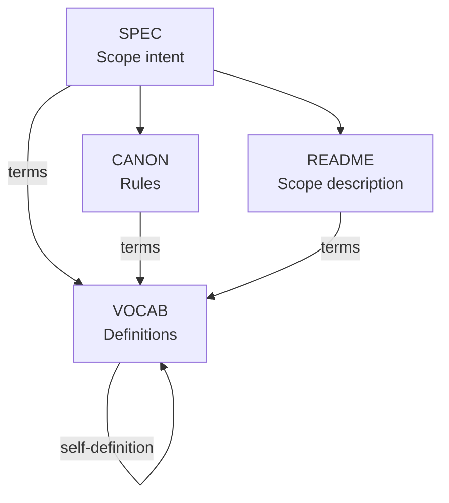
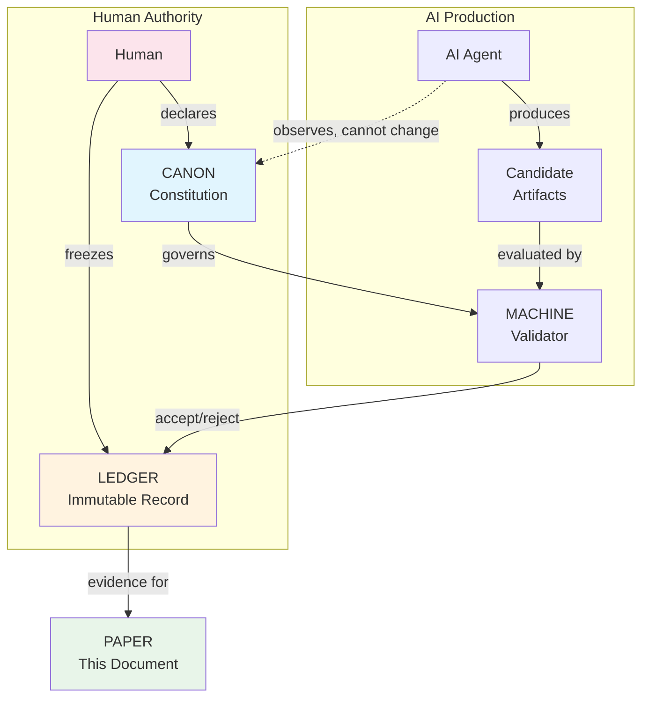
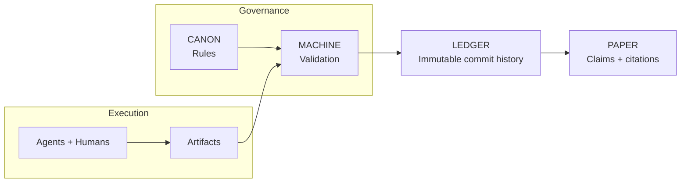
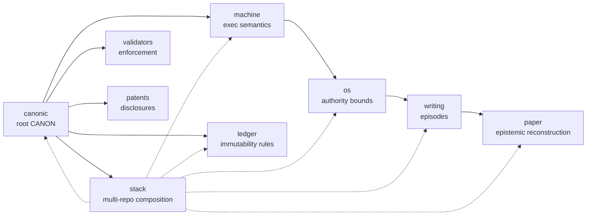
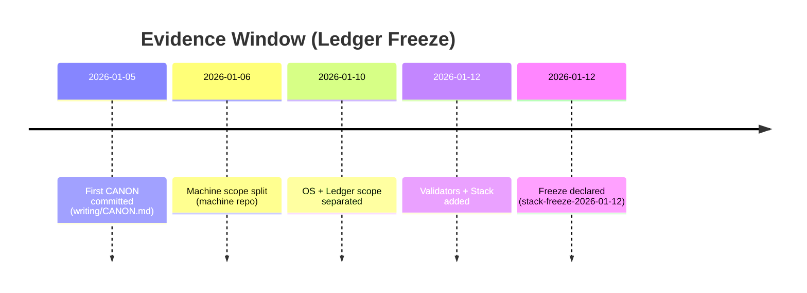

# We Made an AI Write a Paper It Can't Lie About

**Dexter Hadley**

---

## Abstract

What if an AI could not bullshit its way through scientific prose—not because it chose not to, but because the system rendered unsupported claims inadmissible? We call this failure mode **AI slop**.

CANONIC is the governance framework we built to make AI slop structurally inadmissible. Claims must trace to a ledger; every term used in rules must be defined; the AI cannot promote its own ideas to law. Across 129 recorded episodes at `stack-freeze-2026-01-12`, we observed recurring failures (undefined terms, evidence gaps, governance leakage) and the corrections that followed.

The result is this paper. It does not describe an experiment. It is the experiment. Key claims cite evidence references (commits, tags, episodes) so you can verify them yourself.

We asked whether a governed human-AI system could produce a self-evidencing scientific paper. You are reading the answer.

---

## Why Should You Care?

"Help me understand what this is for." — Fatima Boukrim

AI writes convincingly. It also makes things up.

When your doctor uses AI to summarize research, you want that summary to be true. When a scientist uses AI to draft a paper, you want the claims to be real. When policy is shaped by AI-assisted analysis, you want the evidence to exist.

Right now, you have to trust. Trust the author checked. Trust the AI didn't hallucinate. Trust the peer reviewers caught the errors.

We built a system where you don't have to trust. You can verify.

Every claim in this paper links to a commit. Every commit is in a public ledger. Clone the repos. Check for yourself. The evidence is the system that produced the evidence.

This matters because AI is already writing science. The question is whether we govern it or hope for the best.

---

## The Problem: AI Slop Is Eating Scientific Writing

LLMs are everywhere in research. They are powerful—until they are not.

The failure mode has a name: **AI slop**. It reads as authoritative and means nothing: undefined terms, unverifiable claims, confident fabrications. The AI equivalent of padding an essay.

Current defenses fail:

- **Detection tools** are unreliable and easily fooled
- **Disclosure policies** are unverifiable ("I used AI responsibly" proves nothing)
- **Human review** catches AI slop but does not prevent it

We wanted something different: a system where AI-slop-like failure modes are structurally inadmissible to the ledger—invalid by construction, not filtered out.

---

## The Idea: Constitutional AI Governance

The insight is simple: treat AI collaboration like a legal system.

The root primitive is the Triad—`CANON.md`, `VOCAB.md`, and `README.md`.

With the Triad in place, a constitution defines validity, a ledger records what happened, and courts (validators) check compliance. Crucially, the AI can observe and propose, but only humans can change the rules.

We call the framework CANONIC. In the frozen stack, it rests on seven governance primitives.

### 1. Triad

Every scope needs three files: `CANON.md` (rules), `VOCAB.md` (definitions), `README.md` (description). Missing any makes the scope invalid. When present, `SPEC.md` is part of the closure: SPEC, CANON, and README may only use terms defined in VOCAB.

Figure 1 shows the triad and closure rules across SPEC, CANON, VOCAB, and README.



This closure makes terms admissible before any downstream execution.

### 2. Inheritance

Rules flow from a root constitution. You can add constraints downstream, but you cannot override upstream rules.

### 3. Introspection

Every term used in the rules must be defined. If CANON says "episode," VOCAB must define "episode." Undefined jargon = invalid scope.

### 4. Immutability (governed)

The ledger is treated as immutable. Corrections happen via new commits; history rewriting is disallowed by governance.

### 5. Model identity disclosure (best practice)

Sessions SHOULD record the actual model identity. This was not consistently captured early; the gap is documented as a limitation (see Limitations).

### 6. Ledger-first evidence

Claims without evidence references are inadmissible; "the system achieved compliance" means nothing unless you can point to the commit where it happened.

### 7. Insight-law separation

The AI can discover patterns and propose ideas. But those insights have zero legal force until a human explicitly adds them to CANON.

### Governance loop

Figure 2 sketches the governance loop across authority, execution, and evidence.



This loop explains why authority stays human while execution can scale.

---

## What We Actually Did

With the primitives and governance loop established, we built the system across the public CANONIC stack:

| Repo | Purpose |
|------|---------|
| canonic | Root constitution |
| machine | Execution semantics |
| os | Authority bounds |
| ledger | Immutability rules |
| writing | Episode production |
| paper | This paper's governance |
| stack | Multi-system composition |
| validators | Enforcement outcomes (public) |
| patents | Disclosures and governance IP |
| publishing | Submission and dissemination artifacts |

Enforcement outcomes are recorded in the ledger; validator implementations may be public or private.

Publishing is a post-freeze dissemination scope and is not part of the freeze evidence window.

### Ledger-as-evidence pipeline

The pipeline below shows how rules become evidence and claims.



This pipeline is the basis for the evidence window and claim admissibility.

### From single scope to multi-repo

With the evidence pipeline in place, we can show how the architecture expanded. Figure 3 shows the single-scope system becoming a multi-repo stack.



The expansion created distinct scopes without collapsing governance boundaries. That stack boundary defines the evidence window described next.

### Minimal CANONIC OS (operating substrate)

We treat CANONIC OS as the operating substrate for the LLM: a frozen, minimal layer
that constrains execution and does not mutate during a session. The OS is not a
policy playground; it is the stable substrate on which downstream scopes rely.

Best practice: instantiate new WRITING and PAPER work against a frozen OS so the
evidence window stays stable and governance does not drift under the experiment.

For this paper, the OS substrate is `os:4c2919d` at `stack-freeze-2026-01-12`.

### Evidence window

Version v0.1.0 (anchor tag `stack-freeze-2026-01-12`)

Pre-freeze evidence is anchored at tag `stack-freeze-2026-01-12` (tag timestamp `2026-01-12T18:34:47-05:00`, commit `writing:f8acf128`). All counts and timestamps in this manuscript are computed from that tag. Post-freeze revisions are marked as reconstruction.

At `stack-freeze-2026-01-12`, the writing repo contains 129 episode artifacts in `writing/episodes/`, documenting human-AI collaboration. When applicable, episodes record:

- Explicit model disclosure
- Commit-linked evidence
- Documented violations and corrections

The system evolved through recorded revisions. By the freeze tag, the root CANON in `canonic` contains three axioms, and each scope's vocabulary is defined in its own `VOCAB.md`. Episodes ep019, ep053, and ep060 document the compression path.

On January 12, 2026, we froze the ledger:

> "I declare that all SPEC evolution across the CANONIC stack is complete and stable... This declaration constitutes human fixation." - Dexter Hadley

Figure 4 anchors the evidence window timeline.



The first CANON artifact in the stack is `writing/CANON.md` at `2026-01-05T14:13:20-05:00` (`writing:bca9ec0`). The freeze declaration at `stack-freeze-2026-01-12` (`writing:f8acf128`, tag timestamp `2026-01-12T18:34:47-05:00`) occurred **7 days, 4:21:27** later.

Everything at or before the freeze is evidence. Everything after is reconstruction.

---

## Results: Observations at Freeze

At freeze, the triad compliance report lists 12 triad scopes across 9 repositories (see `writing/episodes/ep136-stack-compliance-reports.md`). Figure 1 shows the triad closure model.

Each listed scope contains CANON, VOCAB, and README at the freeze tag.

### The Violation Record

At freeze, 33 episodes are explicitly labeled as violations by filename (`writing/episodes/*violation*`).

Every violation was detected (mechanically or by review), documented (in an episode), and corrected (via new commit, never revision).

The violations are features, not bugs. They show the system catches problems and preserves the learning process.

### Post-freeze signal (preliminary)

We also reviewed the post-freeze slice recorded after `stack-freeze-2026-01-12`.
Five episodes exist in that window (ep132-ep136). One is violation-labeled (ep133).
The sample is too small to support a performance claim. We treat it as a
hypothesis for the next freeze (v0.1.1), not evidence.

| Window | Episodes | Violation-labeled | Status |
|--------|----------|-------------------|--------|
| Pre-freeze | See freeze window above | See freeze window above | Evidence |
| Post-freeze | 5 (ep132-ep136) | 1 (ep133) | Reconstruction |

This table is informational only and does not support a performance claim.

### The Compression

Governance shrank by iteration. Root axioms were reduced to three, and vocabularies stabilized at scope level. The change is visible across the refactoring, minimalism, and fixed-point episodes (ep019, ep053, ep060).

The evidence links below map these observations to the ledger.

---

## Evidence Links (Key Claims)

The table below links key claims to ledger evidence.

| Claim | Evidence reference |
|-------|--------------------|
| "129 episode artifacts" | `writing/episodes/` file count at tag `stack-freeze-2026-01-12` |
| "33 violation-labeled episodes" | `writing/episodes/*violation*` file count at tag `stack-freeze-2026-01-12` |
| "12 triad scopes across 9 repos" | `writing/episodes/ep136-stack-compliance-reports.md` (Report A) |
| "First CANON timestamp" | `writing/CANON.md` initial commit `writing:bca9ec0` |
| "Freeze timestamp" | tag `stack-freeze-2026-01-12` (tag timestamp `2026-01-12T18:34:47-05:00`, commit `writing:f8acf128`) |
| "OS is minimal substrate (frozen) for downstream work" | `writing/episodes/ep100-os-initiation-and-refactor.md`, `writing/episodes/ep101-canonic-os-minimality-report.md` |

You do not have to trust us. Clone the repos. Replay the history. The evidence is the system that produced the evidence.

Traditional papers describe experiments that happened elsewhere; this paper is the experiment it describes. The method, results, and limitations all derive from the same ledger. With evidence mapped, we can discuss why it matters.

---

## Why This Matters

### For Scientific Publishing

If this approach generalizes, papers could be verifiable by construction. Instead of "trust the authors," check the ledger.

Peer review could become: "Does every claim link to evidence? Do the commits exist? Is the governance valid?" Mechanical verification replaces subjective trust.

### For AI Collaboration

The framework improves attribution when model identity is recorded: which model, which session, which commits.

It also clarifies authority. The AI can contribute, but it cannot change the rules. Insight-law separation keeps governance human.

### For AI Slop

The primitives target AI-slop-like failure modes by making them invalid to commit:

| Primitive | What It Blocks |
|-----------|----------------|
| Triad | Incomplete scopes |
| Inheritance | Invented authority |
| Introspection | Undefined jargon |
| Immutability | Polished-away mistakes |
| Model disclosure | Anonymous AI |
| Ledger-first | Unsupported claims |
| Insight-law separation | AI self-promotion |

This is not a filter. It is a governance boundary.

---

## Limitations (Honest Ones)

We do not claim:

- **Optimality**: These seven primitives work here. Fewer might suffice.
- **Generalizability**: This worked for governance specs. Other domains may differ.
- **Scalability**: 9 public repos, 129 episode artifacts at `stack-freeze-2026-01-12`. Enterprise scale is unproven.
- **Model identity completeness**: Some early episodes lack explicit model IDs; this gap is documented post-freeze in ep135.

The study is bounded by one frozen ledger. Claims are observations within that window.

---

## Try It Yourself

The system is in the ledger. Clone it. Check compliance. Trace any claim to its commit.

```
# Example: writing repo evidence

git clone https://github.com/canonic-machine/writing.git
cd writing
git checkout stack-freeze-2026-01-12
```

For the full stack list, see `stack/public/STACK.yml` in the stack repo.

---

## Conclusion

We asked: can a governed human-AI system produce a self-evidencing scientific paper?

Within this evidence window, the answer is yes.

### What we built

In 7 days, 4 hours, and 21 minutes—from first CANON commit to freeze declaration—we constructed:

| Metric | Count |
|--------|-------|
| Governed repositories | 9 |
| Episode artifacts | 129 |
| Violation-labeled episodes | 33 |
| Triad-compliant scopes | 12 |
| Governance primitives | 7 |
| Root axioms | 3 |

The system grew through recorded iteration. Every failure was caught, documented, and corrected via new commit. The violations are features: they prove the governance catches problems and preserves the learning process.

### What this means

Constitutional governance makes verifiability structural, not procedural. The paper does not just report an experiment; it is the experiment, and you can replay it.

Traditional papers describe work that happened elsewhere. This paper is the work. The method, results, and limitations all derive from the same ledger. Clone the repos. Trace any claim to its commit. The evidence is the system that produced the evidence.

### What comes next

This is v0.1—the frozen evidence window. The system continues to evolve. New discoveries made after the freeze will appear in future versions, each anchored to its own evidence window.

The framework is open. The ledger is public. We invite verification, replication, and extension.

---

## Evidence

**Evidence window:** `stack-freeze-2026-01-12` (tag timestamp `2026-01-12T18:34:47-05:00`, commit `writing:f8acf128`)

**First CANON artifact:** `writing/CANON.md` commit `writing:bca9ec0` at `2026-01-05T14:13:20-05:00`

**Time to freeze:** 7 days, 4:21:27 (from first CANON to freeze tag timestamp)

**Public repositories** (tagged at `stack-freeze-2026-01-12`):
- canonic:0b063b8
- machine:a57f159
- os:4c2919d
- ledger:3b95de2
- writing:f8acf12
- paper:0ee1970
- stack:f58ad6d
- validators:e772048
- patents:4bd3dd0

**Key episodes**: ep019 (refactoring), ep053 (root minimalism), ep060 (minimal axioms), ep131 (full stack triad compliance)

**Post-freeze corrections (not part of the evidence window)**: ep135 (model identity gap)

**Freeze declaration**: Dexter Hadley, 2026-01-12

---

## Appendices

### Appendix A - Mathematical Appendix (Proof Sketches)

These are proof sketches that formalize why AI slop is structurally inadmissible
under CANONIC governance. They are descriptive and bounded to this system.

#### Notation

Let:

- $\mathcal{C}$ be the set of claims in PAPER.
- $\mathcal{E}$ be the set of episodes.
- $\mathcal{L}$ be the set of ledger evidence (commits and tags).
- $\mathcal{V}$ be the vocabulary (defined terms in VOCAB).
- $\mathrm{Terms}(c)$ be the set of terms used by claim $c$.
- $T(c,\ell)$ be the traceability predicate ("$c$ traces to ledger item $\ell$").
- $B(c,e)$ be the bounding predicate ("$c$ is bounded by episode $e$").
- $V(c)$ be vocabulary closure for $c$.
- $A(c)$ be admissibility of $c$.
- $S(c)$ be AI slop for $c$.
- $U(t)$ be undefinedness of term $t$.
- $\mathrm{Invalid}(\mathrm{scope})$ indicate a scope fails validity constraints.

#### Definitions

**D1. Vocabulary closure**
$$
V(c) \iff \mathrm{Terms}(c) \subseteq \mathcal{V}
$$

**D2. Admissible claim**
A claim is admissible if and only if it is traceable to ledger evidence, bounded
by episodes, and vocabulary-closed.
$$
A(c) \iff \exists \ell \in \mathcal{L}, \exists e \in \mathcal{E} :
T(c,\ell) \land B(c,e) \land V(c)
$$

**D3. Undefined term**
Let $\mathcal{R}$ be the set of terms appearing in CANON/README.
$$
U(t) \iff t \in \mathcal{R} \land t \notin \mathcal{V}
$$

**D4. AI slop**
AI slop is any claim that fails admissibility or uses undefined terms:
$$
S(c) \iff \neg A(c) \lor \exists t \in \mathrm{Terms}(c) : U(t)
$$

#### Lemma 1 - Unsupported claims are inadmissible

If a claim lacks ledger evidence, it is not admissible.
$$
\neg \exists \ell \in \mathcal{L} : T(c,\ell) \Rightarrow \neg A(c)
$$

**Sketch.** Direct from D2.

#### Lemma 2 - Vocabulary violations invalidate admissibility

If a claim uses an undefined term, it is inadmissible.
$$
\exists t \in \mathrm{Terms}(c) : U(t) \Rightarrow \neg A(c)
$$

**Sketch.** By D1 and D2, $V(c)$ is required for $A(c)$. If $U(t)$ appears in
$\mathrm{Terms}(c)$, then $V(c)$ fails and so does $A(c)$.

#### Proposition 1 - AI slop is structurally rejected

AI slop cannot be admitted as a claim in CANONIC PAPER.
$$
S(c) \Rightarrow \neg A(c)
$$

**Sketch.** D4 implies either $\neg A(c)$ directly or a vocabulary violation,
which by Lemma 2 implies $\neg A(c)$.

#### Proposition 2 - Undefined governance terms invalidate scope

If a governing term is undefined, the scope is invalid.
$$
U(t) \Rightarrow \mathrm{Invalid}(\mathrm{scope})
$$

**Sketch.** By introspection, every term in CANON/README must be in $\mathcal{V}$.
If not, the scope fails validity and cannot yield admissible claims.

#### Proposition 3 - Ledger immutability preserves traceability

Let $L_t$ be the ledger state at time $t$. Immutability implies:
$$
L_t \subseteq L_{t+1}
$$

**Sketch.** Corrections add new records instead of overwriting old ones. Thus
evidence chains are monotonic and fully reconstructable.

#### Corollary - Non-erasure of evidence

For any correction chain $x \to x'$,
$$
x \in L_t \land x' \in L_{t+1}
$$
so both the original and correction remain visible for forensic reconstruction.

---

### Appendix B - Reproducibility Methods

This appendix summarizes steps to reproduce key checks in the frozen evidence
window. It is descriptive and does not define governance.

#### B1. Evidence window checkout

1. Clone the repo
2. Checkout the freeze tag
3. Confirm commit IDs

Example:

```
git clone https://github.com/canonic-machine/writing.git
cd writing
git checkout stack-freeze-2026-01-12
```

#### B2. Triad compliance checks

1. Verify `CANON.md`, `VOCAB.md`, `README.md` exist for each scope
2. Verify `LICENSE` and `NOTICE` at repo roots

#### B3. Claim traceability

1. Locate claim in manuscript
2. Follow cited episode or ledger reference
3. Confirm evidence exists in frozen ledger

---

### Appendix C - Claim Admissibility Checklist

Use this checklist to verify that a claim is admissible under PAPER CANON.

#### Checklist

- Claim has a cited ledger reference (commit or tag).
- Claim is bounded by recorded episodes.
- Claim uses only defined terms (VOCAB closure).
- Claim is stated as an observation, not a new rule.
- Evidence exists within the freeze window when required.

This checklist is descriptive and does not define governance.

---

## Acknowledgments

Fatima Boukrim asked the question—"Help me understand what this is for"—that led to the "Why Should You Care?" section and grounded this paper for a lay audience.

The AI agents (Claude Opus 4.5, Claude Sonnet 4.5, GPT-5) contributed production under governance. Their contributions are recorded in the ledger with model identity disclosure.

---

*This revision was produced under CANONIC governance.*
*Model: claude-opus-4-5-20251101 (Claude Code)*
*Key claims trace to the frozen ledger.*

---
