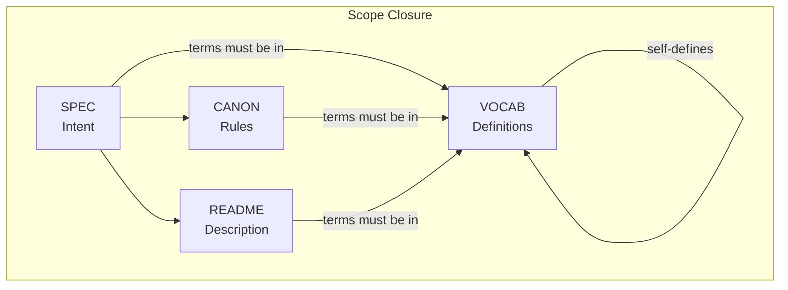
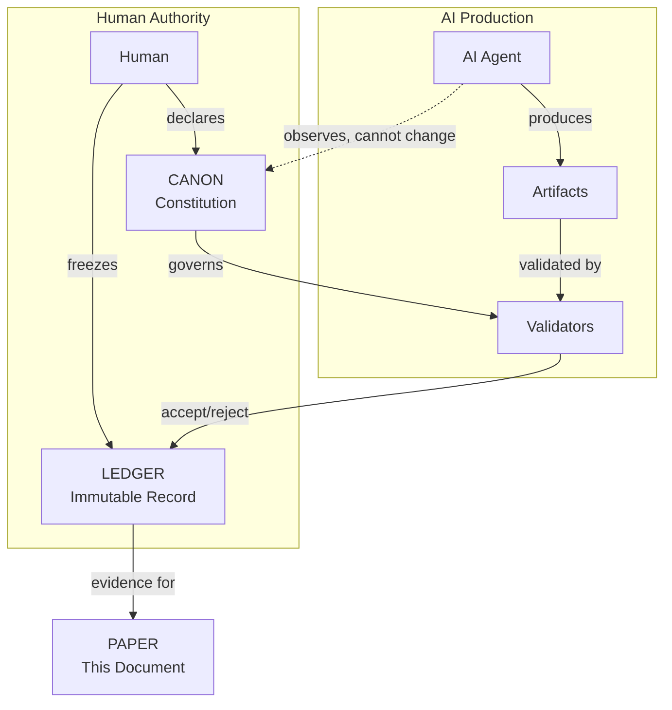
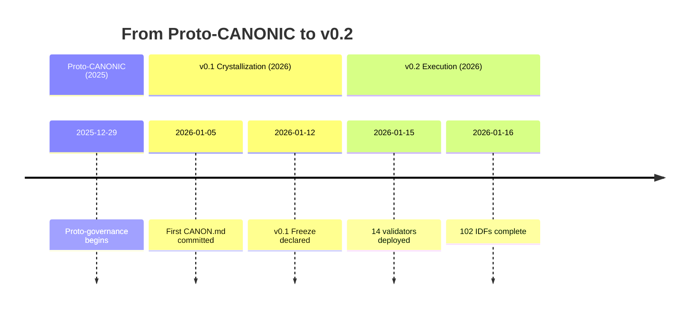
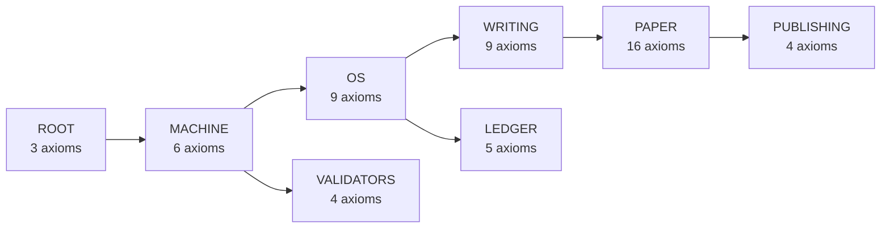

# We Made an AI Write a Paper It Can't Lie About

**Dexter Hadley**

---

## Abstract

What if an AI could not bullshit its way through scientific prose—not because it chose not to, but because the system rendered unsupported claims inadmissible? We call this failure mode **AI slop**.

CANONIC is the governance framework we built to make AI slop structurally inadmissible. Claims must trace to a ledger; every term used in rules must be defined; the AI cannot promote its own ideas to law.

This paper spans two evidence windows. At v0.1 freeze, we observed 129 episodes and 33 violations across 9 repositories. Post-freeze (v0.2), the system evolved to 168 episodes, 102 IDFs, and 14 deployed validators across 54 governed scopes.

The result is this paper. It does not describe an experiment. It is the experiment. Every claim cites evidence so you can verify it yourself.

---

## Why Should You Care?

> "Help me understand what this is for." — Fatima Boukrim

AI writes convincingly. It also makes things up.

When your doctor uses AI to summarize research, you want that summary to be true. When a scientist uses AI to draft a paper, you want the claims to be real. When policy is shaped by AI-assisted analysis, you want the evidence to exist.

Right now, you have to trust. Trust the author checked. Trust the AI didn't hallucinate. Trust the peer reviewers caught the errors.

We built a system where you don't have to trust. You can verify.

Every claim in this paper links to a commit. Every commit is in a public ledger. Clone the repos. Check for yourself. The evidence is the system that produced the evidence.

---

## The Problem: AI Slop Is Eating Scientific Writing

LLMs are everywhere in research. Powerful—until they are not.

The failure mode has a name: **AI slop**. Reads as authoritative, means nothing. Undefined terms, unverifiable claims, confident fabrications. The AI equivalent of padding an essay.

Current defenses fail:

- **Detection tools** are unreliable and easily fooled
- **Disclosure policies** are unverifiable ("I used AI responsibly" proves nothing)
- **Human review** catches AI slop but does not prevent it

We wanted something different: a system where AI slop is structurally inadmissible—invalid by construction, not filtered out. So we built one.

---

## The Idea: Constitutional AI Governance

The insight is simple: treat AI collaboration like a legal system.

The root primitive is the **Triad**—`CANON.md`, `VOCAB.md`, and `README.md`. Every governed scope requires these three files. When present, SPEC (named `CANONIC.md` at root, `PAPER.md` for paper) defines scope intent and completes the closure.



SPEC defines intent (non-normative). CANON defines validity (normative). All artifacts use terms that must be defined in VOCAB. This closure makes terms admissible before any downstream execution.

With the closure in place, a constitution defines validity, a ledger records what happened, and validators check compliance. Crucially, the AI can observe and propose, but only humans can change the rules.

We call the framework CANONIC. It rests on three root axioms:

**1. Triad** — Every scope MUST contain `CANON.md`, `VOCAB.md`, and `README.md`. Missing any renders the scope invalid.

**2. Inheritance** — Every CANON MUST declare what it inherits from. Inherited axioms are final and MUST NOT be overridden.

**3. Introspection** — VOCAB MUST define every concept used by CANON and by VOCAB itself. Undefined concepts render the scope invalid.

These three axioms generate the entire constitutional structure. Every downstream axiom is either a specialization or a boundary declaration. (See Appendix A1 for full axiom text.)

### The Governance Loop



This loop explains why authority stays human while execution can scale. Validators enforce the constitution; the ledger preserves evidence; the paper reconstructs what happened.

---

## What We Actually Did

We built the system across 10 public repositories with 54 governed scopes. The full repository list and axiom counts appear in Supplement S1.

The system did not start as ten repositories. It started as a book. On December 29, 2025, we began writing *Dividends & Deaths* and created proto-governance artifacts: `CANNON.md` (note the double N), `VOCABULARY.md`, and the Triad concept.

Within one week of the new year, the kernel crystallized. Proto-CANONIC became CANONIC. By v0.1 freeze on January 12, 2026, the stack had grown to 9 repositories with 12 triad-compliant scopes.



**Evidence:** Timeline details in Supplement S2.

### Inheritance Architecture



Rules flow from root; constraints accumulate; no downstream scope can override its parent.

---

## Results

### v0.1 Freeze Window

At `stack-freeze-2026-01-12`:

| Metric | Count |
|--------|-------|
| Episode artifacts | 129 |
| Violation-labeled | 33 |
| Triad-compliant scopes | 12 |
| IDFs | 52 |
| Root axioms | 3 |

Every violation was detected, documented, and corrected via new commit (never revision). Violations are features, not bugs—they prove the system catches problems and preserves the learning process.

**Evidence:** `writing/episodes/ep136-stack-compliance-reports.md`

### v0.2 Post-Freeze Execution

Post-freeze, the system evolved significantly:

| Metric | v0.1 | v0.2 | Delta |
|--------|------|------|-------|
| Episodes | 129 | 168 | +39 |
| Violations | 33 | 40 | +7 |
| CANON files | 12 | 54 | +42 |
| IDFs | 52 | 102 | +50 |
| Validators | 0 | 14 | +14 |

**Validator Deployment:** 14 validators now enforce the constitution, from triad-validator (checks basic structure) to axiom-bloat-validator (detects inheritance violations). Full validator list in Supplement S3.

**Axiom Bloat Remediation:** We discovered 29% axiom bloat—58 axioms were re-declarations of inherited constraints. After remediation via axiom-bloat-validator (IDF-102), the stack compressed to lean form. Remediation details in Supplement S4.

**Axiom Clustering:** Nine semantic clusters emerged from analyzing all 228 axioms. The dominance of MUST/MUST NOT (96%) reflects constitutional intent: hard constraints, not recommendations. Cluster analysis in Supplement S5.

---

## The Protocols-to-Patents Drift

An unexpected observation: **CANONIC drifted from documentation protocols to IP generation.**

| Phase | Focus | Output |
|-------|-------|--------|
| 1. Protocols | Documentation structure | CANON, VOCAB, README |
| 2. Governance | Axiom enforcement | Validators |
| 3. Constitutional | Formal authority | Inheritance, separation |
| 4. IP-First | Patents as product | IDFs, claims |

When documentation is rigorous enough to govern AI constitutionally, it achieves patent-specification rigor. VOCAB defines every term (patent requires clarity). CANON declares requirements (patent requires method steps). Validators produce PASS/FAIL (patent requires enablement).

**Insight:** Documentation protocols that can govern AI are already patent-ready.

| Metric | v0.1 | v0.2 | Growth |
|--------|------|------|--------|
| IDFs | 52 | 102 | 96% |
| Claims | 54+ | 100+ | 85% |

### The Genomics Parallel

We observed the same pattern in genomics: cancer fixed as the prominent application because cancer *is* genomic dysfunction by definition. The application wasn't chosen—it was revealed by the structure of the domain.

| Domain | Structure | Inevitable Application |
|--------|-----------|------------------------|
| Genomics | Gene sequences and mutations | Cancer (genomic dysfunction) |
| CANONIC | Governance specifications | Patents (specification protection) |

In both cases, the "application" was not a choice but a recognition. Genomics didn't *decide* to focus on cancer—cancer is what happens when genomes fail. CANONIC didn't *decide* to generate patents—patents are what governance specifications become when formalized sufficiently.

This parallel suggests a general principle: **rigorous formalization reveals its natural application domain.**

**Evidence:** `patents/disclosures/`, IDF-041 (Patent Machine)

---

## Why This Matters

**For Scientific Publishing:** Papers could be verifiable by construction. Instead of "trust the authors," check the ledger. Peer review becomes: Does every claim link to evidence?

**For AI Collaboration:** Authority stays clear. The AI contributes but cannot change the rules. **Insight-law separation** is the key primitive: the AI can discover patterns and propose ideas, but those insights have zero governance force until a human explicitly adds them to CANON. This is why CANONIC can use AI at scale without surrendering authority.

**For AI Slop:** The primitives block slop at commit time—incomplete scopes, invented authority, undefined jargon, polished-away mistakes, unsupported claims. This is not a filter. It is a governance boundary.

---

## Limitations

We do not claim:

- **Optimality**: Three root axioms work here. Other configurations may work.
- **Generalizability**: This worked for governance specs. Other domains may differ.
- **Scalability**: 10 repos, 168 episodes. Enterprise scale is unproven.
- **Model identity completeness**: Some early episodes lack explicit model IDs (documented in ep135).

The study is bounded by two evidence windows: v0.1 freeze and v0.2 current state.

**Manuscript Drift:** This manuscript has evolved through 50+ commits. Early versions described "seven primitives" (triad, inheritance, introspection, immutability, model identity, ledger-first, insight-law separation). The current manuscript presents three root axioms (Triad, Inheritance, Introspection) with downstream primitives as specializations. This consolidation is intentional—the three axioms generate all other constraints—but readers should note that earlier commits used different framings.

---

## Conclusion

We asked: can a governed human-AI system produce a self-evidencing scientific paper?

Within these evidence windows, the answer is yes.

| Metric | v0.2 Count |
|--------|------------|
| Repositories | 10 |
| CANON files | 54 |
| Episodes | 168 |
| IDFs | 102 |
| Validators | 14 |
| Root axioms | 3 |

The system grew through recorded iteration. Every failure was caught, documented, and corrected. The violations prove the governance works.

This manuscript follows the **describe-then-demonstrate** pattern: v0.1 described findings as observations; v0.2 demonstrates features that were provisional. Provisional claims in v0.1 become evidence in v0.2 when the system exhibits the described behavior. The paper proves itself by running.

Constitutional governance makes verifiability structural, not procedural. Traditional papers describe work that happened elsewhere. This paper is the work. Clone the repos. Trace any claim. The evidence is the system that produced the evidence.

---

## Evidence Window Declaration

**v0.1:** Tag `stack-freeze-2026-01-12`, commit `writing:f8acf128`, timestamp `2026-01-12T18:34:47-05:00`

**v0.2:** Date 2026-01-16, current ledger state (post-freeze reconstruction)

**Proto-CANONIC:** Commit `dividends:07a5834`, timestamp `2025-12-29T13:42:56-05:00`

**First CANON:** Commit `writing:bca9ec0`, timestamp `2026-01-05T14:13:20-05:00`

**Freeze Declaration:** Dexter Hadley, 2026-01-12

---

## Acknowledgments

Fatima Boukrim asked "Help me understand what this is for"—leading to the "Why Should You Care?" section.

The AI agents (Claude Opus 4.5, Claude Sonnet 4.5) contributed production under governance. Their contributions are recorded in the ledger with model identity disclosure.

---

*This manuscript was produced under CANONIC governance.*
*Model: claude-opus-4-5-20251101 (Claude Code)*
*Evidence windows: v0.1 (stack-freeze-2026-01-12), v0.2 (2026-01-16)*

---

# Appendix (Invariant)

## A1. Root Axioms (Full Text)

From `canonic/CANON.md`:

**Axiom 1 — Triad:**
> A scope **MUST** contain the following artifacts: `CANON.md`, `VOCAB.md`, `README.md`. Absence of any triad artifact renders the scope invalid.

**Axiom 2 — Inheritance:**
> Every `CANON.md` **MUST** declare the scope it inherits from. Inheritance **MUST** terminate at `/`. Inherited axioms are final and **MUST NOT** be overridden.

**Axiom 3 — Introspection:**
> `VOCAB.md` **MUST** define every content concept used by its corresponding `CANON.md` and by `VOCAB.md` itself. Undefined content concepts render the scope invalid.

**Evidence:** `canonic/CANON.md:9-38`

---

## A2. Mathematical Formalization

### Notation

- $\mathcal{C}$: Claims in PAPER
- $\mathcal{E}$: Episodes
- $\mathcal{L}$: Ledger evidence (commits, tags)
- $\mathcal{V}$: Vocabulary (defined terms)
- $T(c,\ell)$: Claim $c$ traces to ledger item $\ell$
- $B(c,e)$: Claim $c$ is bounded by episode $e$
- $V(c)$: Vocabulary closure for claim $c$
- $A(c)$: Admissibility of claim $c$

### Definitions

**D1. Vocabulary Closure:**
$$V(c) \iff \text{Terms}(c) \subseteq \mathcal{V}$$

**D2. Admissible Claim:**
$$A(c) \iff \exists \ell \in \mathcal{L}, \exists e \in \mathcal{E} : T(c,\ell) \land B(c,e) \land V(c)$$

**D3. AI Slop:**
$$S(c) \iff \neg A(c) \lor \exists t \in \text{Terms}(c) : t \notin \mathcal{V}$$

### Proposition: AI Slop Is Structurally Rejected

$$S(c) \Rightarrow \neg A(c)$$

**Proof Sketch:** By D3, AI slop either fails admissibility directly or uses undefined terms. Undefined terms violate vocabulary closure (D1), which is required for admissibility (D2). Therefore AI slop cannot be admitted.

---

## A3. Claim Admissibility Checklist

- [ ] Claim has cited ledger reference
- [ ] Claim is bounded by episodes
- [ ] Claim uses only defined terms (VOCAB closure)
- [ ] Claim is observational, not prescriptive
- [ ] Evidence exists within declared evidence window

---

## A4. Reproducibility Protocol

### Evidence Window Checkout

```bash
git clone https://github.com/canonic-machine/writing.git
cd writing
git checkout stack-freeze-2026-01-12
```

### Validator Execution

```bash
# Run triad validator
python3 validators/triad-validator/validate.py canonic/

# Run axiom-bloat validator
python3 validators/axiom-bloat-validator/validate.py .
```

### Claim Verification

1. Locate claim in manuscript
2. Follow evidence reference (commit, tag, episode, IDF)
3. Confirm evidence exists in ledger

---

# Supplement (Growing)

*This section captures system state at v0.2. Values will change as the system evolves.*

---

## S1. Repository and Axiom Inventory (v0.2)

| Repo | Purpose | Local Axioms |
|------|---------|--------------|
| canonic | Root constitution | 3 |
| machine | Execution semantics | 6 |
| os | Authority bounds | 9 |
| ledger | Immutability rules | 5 |
| writing | Episode production | 9 |
| paper | This paper's governance | 16 |
| stack | Multi-system composition | 9 |
| validators | Enforcement (14 deployed) | 4 |
| patents | IP disclosures (102 IDFs) | 9 |
| publishing | Dissemination artifacts | 4 |

**Total CANON files:** 54 (`find . -name "CANON.md" | wc -l`)

**Total axioms:** 228 (sum of `grep -c "^### [0-9]"` across all CANON files)

---

## S2. Evolution Timeline

| Date | Event | Evidence |
|------|-------|----------|
| 2025-12-29 | Proto-governance begins | `dividends:07a5834` |
| 2025-12-29 | CANNON.md, VOCABULARY.md created | Proto-CANONIC artifacts |
| 2026-01-05 | First CANON.md | `writing:bca9ec0` |
| 2026-01-05 | canonic repo created | Kernel extraction |
| 2026-01-06 | Machine scope split | `machine` repo created |
| 2026-01-10 | OS + Ledger separated | `os`, `ledger` repos |
| 2026-01-12 | v0.1 Freeze declared | `writing:f8acf128` |
| 2026-01-16 | v0.2 state | Current ledger |

**Duration:** 14 days from proto-CANONIC to v0.1 freeze; 18 days to v0.2.

**v0.1 Freeze Commits:**
- canonic:0b063b8
- machine:a57f159
- os:4c2919d
- ledger:3b95de2
- writing:f8acf12
- paper:0ee1970
- stack:f58ad6d
- validators:e772048
- patents:4bd3dd0

---

## S3. Validator Inventory (v0.2)

| Validator | IDF | Function |
|-----------|-----|----------|
| triad-validator | IDF-057 | Checks CANON, VOCAB, README presence |
| inheritance-validator | IDF-061 | Validates inheritance declarations |
| introspection-validator | IDF-059 | Ensures VOCAB closure |
| gap-validator | IDF-060 | Detects undocumented patterns |
| axiom-bloat-validator | IDF-102 | Detects inheritance finality violations |
| vocab-locality | IDF-058 | Validates local-only VOCAB terms |
| licensing-validator | — | Checks LICENSE/NOTICE presence |
| lifecycle-validator | — | Validates lifecycle sections |
| closure-validator | — | Validates term closure |
| minimalism-validator | — | Checks governance minimality |
| prefix-canonicity-validator | IDF-093 | Validates naming conventions |
| directory-discriminant-validator | IDF-094 | Validates directory structure |
| structural-bootstrapping-validator | IDF-095 | Validates bootstrapping |
| series-nomenclature-validator | — | Validates episode naming |

**Evidence:** `find validators -name "validate.py" | wc -l` = 14

---

## S4. Axiom Bloat Remediation (v0.2)

The axiom-bloat-validator (IDF-102) detects:
- **EXACT_DUPLICATE**: Local axiom text identical to inherited axiom
- **SEMANTIC_DUPLICATE**: Local axiom semantically equivalent to inherited axiom

**Remediated files:**

| File | Before | After | Removed |
|------|--------|-------|---------|
| `paper/CANON.md` | 16 axioms | 14 axioms | Triad, Inheritance, Introspection |
| `publishing/CANON.md` | 7 axioms | 4 axioms | Triad, Inheritance, Introspection |
| `validators/paper/CANON.md` | 3 axioms | 2 axioms | Non-governance |
| `validators/transcript/CANON.md` | 3 axioms | 2 axioms | Non-governance |
| `validators/vocab-locality/CANON.md` | 4 axioms | 2 axioms | Inheritance, Determinism |
| `writing/episodes/CANON.md` | 5 axioms | 3 axioms | Immutability, Non-authority |
| `writing/streams/CANON.md` | 3 axioms | 2 axioms | Non-authority |

**Evidence:** `patents/disclosures/IDF-102-axiom-bloat-validator.md`, `validators/axiom-bloat-validator/validate.py`

---

## S5. Axiom Clustering Analysis (v0.2)

Nine semantic clusters emerged:

| Cluster | Count | Function |
|---------|-------|----------|
| Constitutional Foundation | 3 | Triad, Inheritance, Introspection |
| Authority & Governance Boundaries | 7 | "MUST NOT define governance" |
| Immutability & Historical Truth | 6 | "MUST NOT be modified" |
| Evidence & Traceability | 5 | Hash anchoring, provenance |
| Human Authority & Automation | 4 | "Humans retain authority" |
| Structural Naming | 4 | Naming conventions |
| Execution & Validation | 4 | Determinism, black-box |
| Scope Composition | 3 | Stack composition |
| Disclosure & Transparency | 3 | Time-to-publication |

**Axiom Grammar:**

| Modal | Count | Percentage |
|-------|-------|------------|
| MUST | 68 | 71% |
| MUST NOT | 24 | 25% |
| MAY | 3 | 3% |
| SHOULD | 1 | 1% |

The dominance of MUST/MUST NOT (96%) reflects constitutional intent: hard constraints, not recommendations.

---

## S6. Evidence Links (v0.2 Claims)

| Claim | Evidence |
|-------|----------|
| "3 root axioms" | `canonic/CANON.md:9-38` |
| "168 episodes" | `ls writing/episodes/*.md \| wc -l` |
| "40 violation-labeled episodes" | `ls writing/episodes/*violation* \| wc -l` |
| "54 CANON files" | `find . -name "CANON.md" \| wc -l` |
| "102 IDFs" | `ls patents/disclosures/IDF-*.md \| wc -l` |
| "14 deployed validators" | `find validators -name "validate.py" \| wc -l` |
| "228 total axioms" | Sum of `grep -c "^### [0-9]"` across all CANON files |
| "29% axiom bloat" | `IDF-102-axiom-bloat-validator.md` |
| "v0.1 freeze" | Tag `stack-freeze-2026-01-12` |
| "First CANON" | `writing:bca9ec0` at 2026-01-05 |
| "Proto-CANONIC" | `dividends:07a5834` at 2025-12-29 |

---
